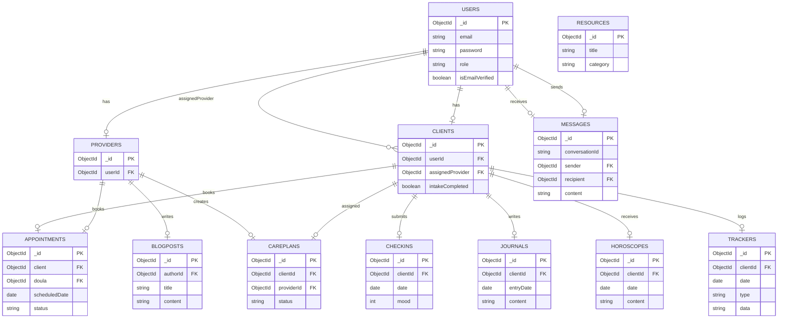

# LUNARA Platform ERD

## Entity Relationship Diagram



## Database Collections Overview

### Core User Management
- **USERS**: Base user authentication and profile data
- **CLIENTS**: Client-specific information and preferences
- **PROVIDERS**: Healthcare provider profiles and credentials

### Communication & Scheduling
- **MESSAGES**: Direct messaging between users
- **APPOINTMENTS**: Scheduled sessions between clients and providers

### Care Management
- **CAREPLANS**: Personalized care plans created by providers
- **CHECKINS**: Regular mood and wellness check-ins from clients
- **TRACKERS**: Health and wellness tracking data (sleep, feeding, etc.)

### Content & Resources
- **RESOURCES**: Educational materials and tools
- **BLOGPOSTS**: Articles and content created by providers
- **JOURNALS**: Private journal entries by clients
- **HOROSCOPES**: Personalized horoscope content for clients

---

## Adding New Collections

When expanding the platform, follow these steps:

1. **Define the entity** with appropriate fields and data types
2. **Establish relationships** with existing collections using foreign keys
3. **Update the ERD** by adding the new entity and its relationships
4. **Document the purpose** and key use cases for the new collection

### Example: Adding a new collection

```mermaid
NEW_COLLECTION {
    ObjectId _id PK
    ObjectId relatedEntity FK
    string requiredField
    date timestamp
}

EXISTING_ENTITY ||--o| NEW_COLLECTION : "relationship_type"
```

---

## Implementation Reference

| Component | Description | Location |
|-----------|-------------|----------|
| ERD File | Entity Relationship Diagram | `Docs/ERD.md` |
| Mermaid Syntax | Diagram definition language | Within markdown code blocks |
| Viewing | Compatible markdown viewers | GitHub, GitLab, VS Code, etc. |

---

## Notes

- All collections use MongoDB ObjectId for primary keys
- Foreign key relationships are established through ObjectId references
- Additional fields can be added to each collection as needed
- The diagram shows core relationships; some many-to-many relationships may require junction tables