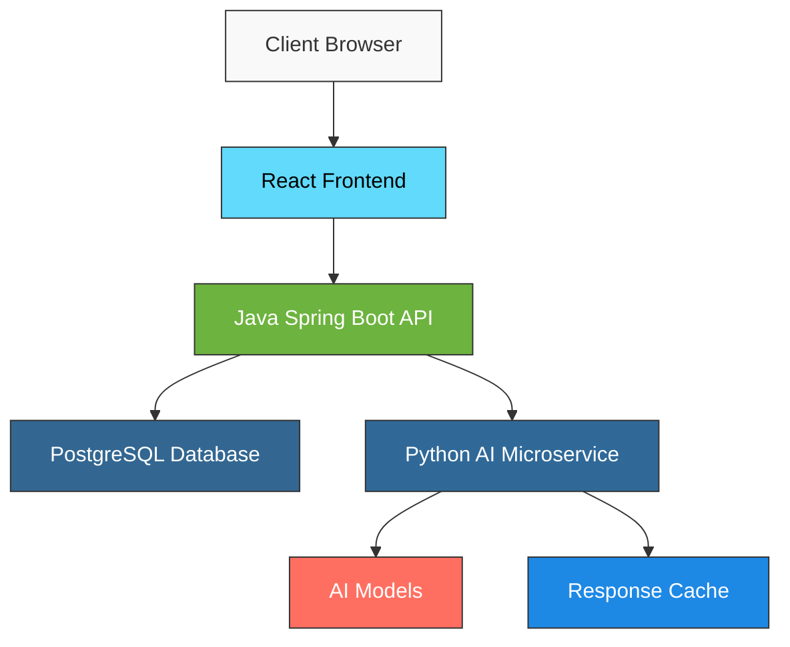
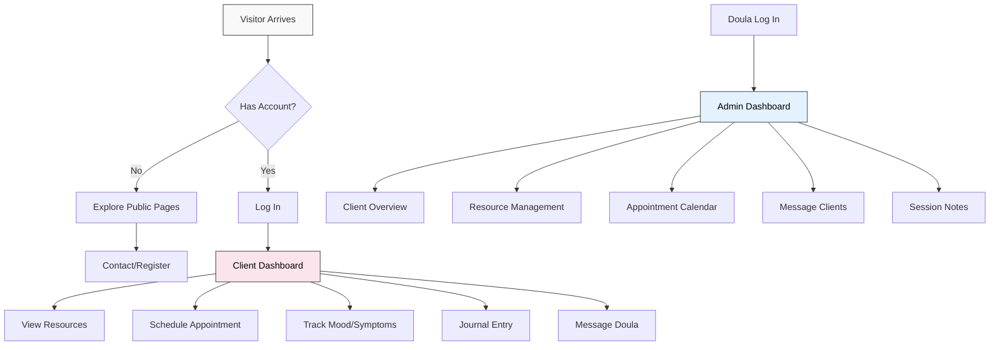

# Grand Canyon University  
**College of Science, Engineering and Technology**  
**Software Development Capstone**

----

## Capstone Proposal

# **LUNARA: A Compassionate Companion for Postpartum Mothers**

----

**Prepared by:**  
*Owen Lindsey, Andrew Mack, Carter Wright*  
Bachelor of Science in Software Development  
Capstone Section: *CST-451*  
Instructor: Amr Elchouemi

----

**Date:**  
*May 11, 2025*

## Postpartum Doula Support Platform Project Proposal

*May 2025*

----

## Table of Contents

- [Executive Summary](#executive-summary)
- [Team Members & Roles](#team-members--roles)
- [Team Coordination & Communication](#team-coordination--communication)
- [Software Description](#software-description)
- [Project Approach](#project-approach)
- [Timeline](#timeline)
- [Project Considerations](#project-considerations)
- [Desired Goals](#desired-goals)
- [Deliverables & Measurement](#deliverables--measurement)
- [Technical Vision](#technical-vision)
- [User Experience](#user-experience)

----

## Executive Summary

"LUNARA" will transform the postpartum support experience through a thoughtfully designed digital platform for both new parents and doulas. By combining enchanting storybook-inspired aesthetics with intuitive, practical tools, we aim to create a digital sanctuary that nurtures families through their fourth trimester journey.

Our vision is to develop a platform that feels less like traditional software and more like a treasured companion—offering personalized guidance, emotional support, and practical resources when families need them most. The gentle interface will provide families with on-demand access to doula wisdom, while giving doulas powerful tools to enhance their practice.

As software development students at Grand Canyon University, we're excited to build this platform as our senior capstone project. Our work will unfold over 20 weeks, culminating in an October 2025 launch. We'll blend modern technology with timeless care principles to create a sustainable, accessible digital solution for postpartum support.

----
## Team Members & Roles

As senior software development students at Grand Canyon University, we're committed to applying our education and skills to create a meaningful solution for postpartum care. **While all team members will collaborate across the entire stack and contribute to all aspects of development throughout the project lifecycle**, each member will leverage their unique strengths and take leadership in specific areas:

**Owen Lindsey** (Full Stack Develope):
- **Primary Responsibilities**: Project management, architecture design, backend API development
- **Technical Focus**: System architecture, database design, API security
- **Leadership Role**: Directs overall project vision, manages timeline, leads team meetings
- **Skills**: JavaScript, TypeScript, C#, Java, various 

**Carter Wright** (Full Stack Developer):
- **Primary Responsibilities**: Frontend development, UI/UX design, component library creation
- **Technical Focus**: React implementation, responsive design, animation and transitions
- **Leadership Role**: Drives interface decisions, creates design system, conducts usability testing
- **Skills**: React development, UI/UX design principles, frontend optimization

**Andrew Mack** (Full Stack Developer):
- **Primary Responsibilities**: Backend services, infrastructure setup, CI/CD implementation
- **Technical Focus**: System security, deployment pipelines, AI integration
- **Leadership Role**: Manages development workflow, ensures code quality, maintains infrastructure
- **Skills**: Backend development, cloud infrastructure, security implementation

**Collaborative Development Approach**:
Our team recognizes that modern software development requires versatility and cross-functional collaboration. While each member has designated areas of leadership based on their strengths, we will all actively participate in full-stack development throughout the project. This approach ensures:

- Knowledge sharing across all technical domains
- Balanced workload distribution
- Comprehensive understanding of the entire system by all team members
- Ability to support each other during intensive development phases
- No single points of failure in our development process

This collaborative approach, combined with clear leadership responsibilities, will create an efficient and resilient team structure that maximizes our collective capabilities while still leveraging each member's unique strengths.

----

## Team Coordination & Communication

We believe in transparency, regular communication, and adaptability. Our team coordination approach ensures consistent progress and quality throughout the development process.

### Agile Development Approach

We embrace the Agile methodology, which means we'll develop the platform in iterative cycles called "sprints." Each two-week sprint will deliver working pieces of functionality that can be reviewed and tested. This approach allows us to:

* Adapt quickly to feedback and changing requirements
* Prioritize features that deliver the most value first
* Provide regular demonstrations of progress
* Make informed decisions based on what we learn

### Communication Rhythm

We'll maintain clear and consistent communication throughout the project:

**Development Cadence:** Our team will maintain a consistent internal rhythm of daily morning check-ins, bi-weekly planning sessions, and end-of-sprint review meetings to ensure steady progress.

**Documentation Focus:** We'll document decisions, architecture, and code throughout the development process, not just at the end, creating a knowledge base for future maintenance.

### Project Visibility Tools

We'll utilize modern collaboration tools that provide transparency and maintain clear documentation:

**Jira** will serve as our task management system, tracking all features being developed and their current status.

**GitHub** will host our code repository with proper review processes to ensure quality and security.

**Discord** will facilitate daily communication within our team.

**Confluence** will host our documentation, including architecture decisions, meeting notes, and technical specifications.

----

## Software Description

"LUNARA" will be a digital sanctuary for new parents in their fourth trimester, weaving together practical support tools with an enchanting storybook aesthetic. The platform will extend nurturing presence into families' daily lives through thoughtfully designed features that prioritize emotional wellbeing, practical guidance, and holistic care.

### The Client Experience

When new parents log into their personalized portal, they'll enter a calming, beautiful digital space that feels like opening a beloved storybook—a respite from the often clinical nature of postpartum resources. Here they will find:

**Personalized Journey Guidance** tailored to their unique birth experience, feeding choices, and recovery needs. The system will adapt content and recommendations based on their postpartum week, presenting relevant resources at the right moments.

**Intuitive Care Tools** including a gentle mood and symptom tracker that helps families notice patterns and communicate concerns. Unlike clinical trackers, ours will use nurturing language and imagery to make self-monitoring feel like self-care.

**Digital Journaling Space** where parents can document reflections, milestones, and questions. The integrated AI companion can offer gentle prompts and affirmations, making it easier to process emotions during this transformative time.

**Direct Connection** to doulas through secure messaging, appointment scheduling, and video call integration. Families will always feel that support is just a touch away when needed.

**Resource Treasury** featuring articles, audio meditations, affirmations, and practical guides—all written in warm, supportive language and beautifully presented. Parents can save favorites and receive personalized recommendations.

**Unique Daily Insights** through features like the "New Mother Horoscope" and "Baby Forecast" that combine astrological elements with developmental wisdom and gentle encouragement, adding a touch of magic to daily routines.

### The Doula Dashboard

As the heart of a doula's practice, the administrative portal will be designed with efficiency and clarity in mind, allowing practitioners to:

**Monitor Client Wellbeing** through an intuitive dashboard that highlights appointments, check-ins, and any mood patterns that might need attention. Doulas will have a comprehensive view of each family's journey while protecting their privacy.

**Streamline Administrative Tasks** with automated appointment reminders, session note templates, and custom care plan builders. These tools will reduce paperwork burden so doulas can focus more time on direct client care.

**Curate Personalized Resources** for specific clients based on their needs and interests. The system will help recommend relevant materials from the resource library while allowing personal touches.

**Gain Meaningful Insights** through thoughtful analytics that show which resources families find most helpful and where they might need additional support. This information will help doulas continually refine their practice.

**Create Beautiful Communications** with newsletter templates and custom content builders that maintain aesthetic consistency without requiring design skills.

### Design Philosophy

The visual and emotional experience of the platform will reflect the gentle transformation of the postpartum period. Drawing inspiration from Studio Ghibli, forest imagery, and the magic of new motherhood, the interface will feature:

**Warm, Natural Color Palette** shifting subtly with the time of day to create a sense of rhythm and gentle transition.

**Custom Illustrations** including the "Mother Tree," "Fourth Trimester Garden," and "Nest of Nurture" integrated thoughtfully throughout the experience.

**Accessible Typography** combining serif fonts for headings with highly readable text for content, ensuring the platform is welcoming to tired eyes and parents with dyslexia.

**Responsive Design** that works beautifully on phones, tablets, and computers, acknowledging that new parents often have a baby in one arm and a device in the other.

----

## Project Approach

Our development philosophy centers on creating a platform that will evolve alongside doula practices, beginning with a solid foundation of essential features and expanding thoughtfully over time. We recognize that postpartum care is a deeply personal field that requires flexibility and adaptation.

### Core Platform Development

The initial development phase will focus on building a comprehensive yet intuitive platform that addresses the fundamental needs of both families and doulas:

**Secure Account Management** with privacy-focused design that respects the sensitive nature of postpartum information. Parents and doulas will have appropriate access levels, simple profile management, and reliable account recovery options.

**Client Journey Support** through personalized dashboards where parents can complete intake forms, schedule appointments, track their wellbeing, journal their experiences, message their doula directly, and access tailored resources—all within a soothing, consistent interface.

**Practice Management Tools** designed to simplify administrative work. The doula dashboard will provide client overviews, appointment scheduling, session documentation, resource management, and insights into how clients are engaging with materials.

**Resource Library System** that organizes wisdom and materials into an accessible digital collection. Parents will be able to filter resources by their needs and postpartum stage, save favorites, and discover content through intuitive navigation and search.

**Thoughtful AI Integration** with features like personalized affirmations, journaling assistance, and resource recommendations that enhance the human connection rather than replacing it. These tools will provide support between doula visits without consuming excessive resources.

**Public Presence** through a carefully crafted website that communicates philosophy and services to potential clients. This will include information pages, a contact system, and content that conveys a unique approach to postpartum care.

**Environmental Consideration** through sustainable digital practices like optimized loading times, energy-efficient design options, and alternatives to printing materials.

### Adaptable Development Process

Following Agile principles means we'll develop these features iteratively, with regular opportunities to assess, prioritize, and refine our approach:

* We'll begin with the foundational elements that support the core client and doula experience
* Each development sprint will deliver working features for testing and feedback
* Feedback will directly shape subsequent development priorities
* New opportunities or insights can be incorporated as they arise

This approach ensures that what we build truly meets the needs of doula practices and clients while allowing for discovery and refinement throughout the process.

----

## Timeline

Our 20-week development timeline is carefully designed to deliver a complete, high-quality platform by October 2025. The compressed schedule focuses on core functionality first with a phased approach to feature delivery.

### Phase 1: Discovery & Foundation (Weeks 1-3)

**Week 1-2**: Requirements analysis, user journey mapping, and technical architecture design
**Week 3**: Environment setup, initial wireframes, and database schema design

**Key Deliverables:**
- Detailed project plan with sprint schedule
- Technical architecture document
- Initial design concepts and wireframes
- Development environment and repository setup

### Phase 2: Core Systems Development (Weeks 4-9)

**Week 4-5**: User authentication system and basic account management
**Week 6-7**: Database implementation and API foundation
**Week 8-9**: Basic client and doula dashboard structures

**Key Deliverables:**
- Functional user authentication system
- Core API services for user management
- Foundational database with essential entities
- Basic dashboard frameworks for both user types

### Phase 3: Feature Implementation (Weeks 10-15)

**Week 10-11**: Appointment scheduling, messaging system, and resource library framework
**Week 12-13**: Journaling tools, mood tracking, and client intake workflows
**Week 14-15**: Session notes, care plans, and analytics foundations

**Key Deliverables:**
- Functional appointment management system
- Secure messaging between clients and doulas
- Resource categorization and delivery system
- Daily tracking and journaling tools

### Phase 4: AI Integration & Refinement (Weeks 16-18)

**Week 16-17**: AI service implementation for personalized content
**Week 18**: Integration of AI features throughout platform

**Key Deliverables:**
- Affirmation generation system
- Journaling assistance feature
- Resource recommendation engine
- Personalized insights delivery

### Phase 5: Testing & Launch Preparation (Weeks 19-20)

**Week 19**: Comprehensive testing, bug fixing, and performance optimization
**Week 20**: Final polishing, documentation completion, and launch preparation

**Key Deliverables:**
- Complete, tested platform ready for deployment
- User documentation and guides
- Administrator documentation
- Deployment scripts and procedures

Throughout all phases, we'll maintain our two-week sprint cadence with regular internal demos and retrospectives to ensure consistent progress and quality.

----

## Project Considerations

Developing the LUNARA platform requires thoughtful navigation of various considerations to ensure we create a solution that is not only beautiful and functional, but also responsible, secure, and sustainable.

### Mindful Technology Approach

**Balancing Innovation with Sustainability**: The AI features that provide personalized support will be developed with careful attention to ongoing operational costs. We'll implement these features using smaller, more efficient models and smart caching strategies to keep the platform affordable to maintain.

**Security as Foundation**: As the platform will hold sensitive information about families during a vulnerable time, we'll implement robust security measures that protect privacy while remaining user-friendly. This includes secure data storage, encryption for sensitive information, and clear permissions that give families control over their data.

**Universal Accessibility**: We recognize that new parents access digital tools in various circumstances—sometimes one-handed, often sleep-deprived, and occasionally with temporary or permanent disabilities. The platform will be designed to WCAG 2.1 AA standards, ensuring it's usable by people with diverse needs and abilities.

**Technical Inclusivity**: Clients will have varying levels of comfort with technology. The interface will be intuitive enough for those with limited technical experience while still providing depth for more advanced users.

### Practical Realities

**Timeline Awareness**: Our 20-week development schedule is designed to be realistic while still moving efficiently toward an October 2025 launch. The schedule includes buffer time for unexpected challenges and opportunities that may arise during development.

**Scalable Foundation**: While initially focused on supporting smaller practices, the platform architecture will be designed to grow without requiring significant redevelopment. This approach protects the investment as practices evolve.

**Integration Possibilities**: For features like the astrological elements, we'll need to evaluate available third-party data sources and APIs, potentially adjusting the implementation approach based on what's available and sustainable.

**Compliance Guidance**: While not subject to HIPAA, the platform will follow similar best practices for handling sensitive health information, positioning doula practices as ones that take client privacy seriously.

----

## Desired Goals

Our shared vision for LUNARA extends beyond creating software—we aim to craft a digital tool that truly enhances the postpartum journey for families while supporting the growth of doula practices.

### Transforming the Fourth Trimester Experience

For families, we envision a platform that becomes a trusted companion during the tender early days of parenthood. It should provide a sense of being held and supported even between doula visits—a digital space that feels like opening a cherished storybook rather than using an app.

Success will mean families feel more confident in their parenting journey, have easier access to personalized guidance when they need it, and experience a stronger connection to their own intuition through thoughtful reflection tools. The platform should demystify the postpartum experience while honoring its sacred nature.

### Elevating the Doula Practice

For doulas, the platform should amplify their impact while respecting their time and energy. It should transform administrative tasks from burdens into seamless experiences that actually enhance connection with clients. We aim to reduce time spent on paperwork by at least 30%, allowing more focus on the families they support.

The platform should also serve as a beautiful extension of the doula's brand, helping articulate a unique approach to postpartum care through both aesthetic elements and functional features. It should support practice growth by making it easier to maintain meaningful connections with more families without sacrificing quality of care.

### Measuring Success

We'll know we've succeeded when:

**Families Embrace the Platform** with at least 70% of clients engaging with it multiple times per week, finding it a natural and helpful part of their postpartum care routine.

**The Digital Experience Feels Like an Extension of Care** as measured through client feedback, with at least 90% reporting that the platform enhances their connection to their doula and their overall postpartum support.

**Administrative Load Lightens Significantly** while the ability to provide personalized care increases, with the platform handling routine tasks reliably so doulas can focus on what only they can provide.

**The System Performs Reliably** with consistent uptime exceeding 99.5% and responsive performance across all devices.

**Technology Costs Remain Sustainable** for practices, with AI features optimized to provide personalized experiences without excessive operational expenses.

----

## Deliverables & Measurement

Our project will culminate in a cohesive digital ecosystem that supports every aspect of postpartum doula practices. Here we outline what we'll deliver and how we'll measure success.

### What We'll Deliver

**A Complete Digital Platform** that includes:

**Family Portal** – A beautiful, intuitive web application where clients can access personalized support. This will include their customized dashboard, appointment system, mood and symptom tracking, digital journaling tools, direct messaging with their doula, secure payment processing, and a personalized resource library—all wrapped in the enchanting storybook aesthetic that defines LUNARA brand.

**Doula Command Center** – A comprehensive practice management system with tools to monitor client wellbeing, manage appointments, record session notes, create and distribute resources, generate personalized care plans, and gain insights into client needs through thoughtful analytics.

**Resource Library System** – A flexible content management system where doulas can organize and share wisdom through articles, audio recordings, downloadable guides, and more. The system will make it easy to categorize materials, update content, and ensure clients find the right resources at the right time.

**Public Website** – A warm, inviting online presence that communicates services and philosophy to potential clients. This responsive site will be optimized for search engines, making it easier for local families to find doula practices.

**Intelligent Support Features** – Thoughtfully integrated AI tools that provide personalized affirmations, journaling assistance, and resource recommendations to extend the supportive presence between visits.

**Knowledge Transfer** – Beyond the software itself, we'll provide comprehensive documentation for all aspects of the platform, along with material that doulas can share with clients to help them navigate their portal.

### Measuring Success

To ensure we're creating a platform that truly serves doulas and their clients, we'll track several key indicators:

**Family Engagement**: We'll measure how frequently clients interact with the platform and which features they find most valuable. Success means at least 80% of clients regularly engaging with their portal.

**Practice Efficiency**: We'll compare the time spent on administrative tasks before and after implementation, aiming for at least a 30% reduction so doulas can focus more time on direct care.

**Technical Performance**: The platform should load quickly (under 3 seconds), function reliably (99.5% uptime), and work smoothly across all devices.

**Client Experience**: Through thoughtful surveys and feedback mechanisms, we'll assess how the platform affects client satisfaction and their overall postpartum experience, targeting a 90% satisfaction rate.

**Operational Sustainability**: We'll monitor the resources required to maintain the platform, particularly for AI features, ensuring monthly costs remain under $50 for these components.

These metrics will help us refine the platform during development and provide doulas with insights for ongoing improvement after launch.

----

## Technical Vision

Our technical approach focuses on creating a platform that combines beautiful aesthetics with reliable performance, security, and sustainability. We've carefully selected technologies that will provide the best foundation for postpartum care needs.

### Core Technology Selection

**Frontend Experience**: We'll craft the user interface using React with TypeScript, creating a responsive application that looks beautiful and functions intuitively on any device. TailwindCSS will help us efficiently implement the storybook-inspired aesthetic while maintaining consistency throughout the experience.

**Secure Foundation**: Java Spring Boot will provide the robust, secure backend for the platform. This mature technology is known for its enterprise-grade security features and reliability—essential qualities for a system handling sensitive postpartum information.

**Data Integrity**: PostgreSQL will serve as the database, offering the perfect balance of flexibility and structure. It excels at storing both structured information (like appointment details and user profiles) and more fluid content (like journal entries and resources).

**Intelligent Support**: A dedicated Python microservice will power the AI features, using smaller, efficient models like GPT-4o-mini to provide personalized support while keeping operational costs low. This approach gives us the ideal balance between capability and sustainability.

### User Journey Visualization

This visualization shows how users will navigate through the platform, highlighting the different experiences for clients versus doulas while maintaining a cohesive overall system.

### Sustainable Infrastructure

We'll host the platform on cloud infrastructure that balances performance, reliability, and cost-efficiency. Our approach includes:

**Scalable Resources** that grow with practices, starting modestly and expanding as needed to support more clients without significant redevelopment.

**Environmental Consideration** through selection of hosting providers with strong sustainability practices and implementation of energy-efficient design principles.

**Reliable Backups** that protect data and ensure business continuity, with automated systems that require minimal oversight.

**Simple Deployment** processes that make updates smooth and reliable, allowing focus on practice rather than technical maintenance.

This technical foundation provides the perfect balance of current best practices and forward-thinking design, creating a platform that will serve doula practices well both now and as they grow.

----

## User Experience

The essence of LUNARA lies in creating a digital space that feels like a natural extension of nurturing presence—a place where new parents feel held, supported, and empowered during a transformative time in their lives.

### Design Philosophy

The platform will embrace a storybook-inspired aesthetic, creating an experience that feels less like traditional software and more like opening a treasured book of support. Each screen will be thoughtfully designed to evoke feelings of calm, warmth, and gentle guidance.

Typography will balance beauty with readability, pairing serif fonts for headings with highly accessible text for content. Every visual element will be chosen not just for aesthetic appeal but for how it makes parents feel during a vulnerable time.

### Client Journey

New parents will experience a platform that grows with them through their fourth trimester:

**Welcoming Beginnings**: From the moment a parent registers, they'll encounter a warm onboarding experience that feels personal rather than clinical. Initial questions will be framed as gentle conversations rather than rigid forms.

**Personal Sanctuary**: Their dashboard will serve as a digital sanctuary—a place where they can track their wellbeing, access resources, and connect with their doula in a way that feels supportive rather than task-oriented.

**Guided Exploration**: As they navigate their postpartum journey, the platform will offer thoughtfully timed suggestions and resources based on their specific needs and timeline, creating a sense of being personally guided.

**Reflective Space**: The journaling feature will provide prompts and affirmations that encourage reflection without pressure, helping parents process their experiences and emotions in a supportive environment.

**Direct Connection**: When they need to reach their doula, the messaging system will maintain a warm, personal feel, ensuring technology enhances rather than diminishes the human connection.

### Doula Workspace

The doula experience using the platform will focus on efficiency and insight, helping provide even better care with less administrative burden:

**Intuitive Overview**: The dashboard will provide a clear picture of clients' journeys, highlighting what needs attention without overwhelming with information.

**Streamlined Workflows**: Tasks like scheduling, session documentation, and resource sharing will flow naturally, with each action requiring minimal steps while maintaining thoroughness.

**Personalization Tools**: Creating customized care plans and resource collections for specific clients will be simple yet powerful, allowing tailored support to each family's unique needs.

**Practice Insights**: Thoughtful analytics will help identify patterns and opportunities across a practice, informing the care approach without reducing clients to mere data points.

Throughout both the client and doula experiences, we'll maintain a careful balance of beauty and function, ensuring the platform feels like a natural extension of caring practice rather than a technological intervention.

----

*We look forward to bringing this vision to life, creating a platform that enhances the sacred journey of the fourth trimester for families and the doulas who serve them.*
