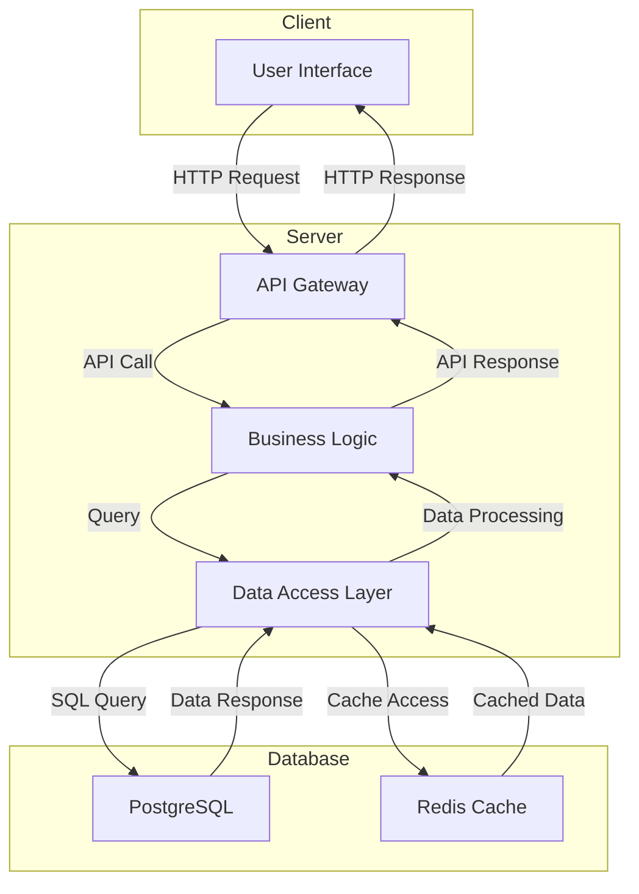

# LUNARA: Postpartum Support Platform

**Author(s):** Owen Lindsey, Carter Wright, Andrew Mack

**CST-451 Capstone Project Requirements Document**

**Grand Canyon University**

**Instructor:** Professor Amr Elchouemi

**Revision:** 1.1

**Date:** May 28, 2025

---

## ABSTRACT

LUNARA is a comprehensive postpartum support platform designed to provide new parents with a digital sanctuary during their fourth trimester journey. The platform combines secure client management, personalized resources, and direct communication with doula support services. This project addresses the critical need for accessible, personalized postpartum care by creating a web-based platform that serves both clients seeking support and doulas providing care.

The system features secure authentication, dynamic intake forms, personalized resource libraries, real-time messaging, appointment scheduling, mood tracking, and unique features like daily "New Mama Horoscopes." For doulas, it provides comprehensive client management tools, AI-powered note summarization, template systems for care plans, and blog publishing capabilities. The platform prioritizes security, mobile responsiveness, and user experience while maintaining HIPAA compliance for sensitive health information.

The completed platform will serve as a bridge between traditional doula services and modern digital accessibility, ensuring consistent, personalized care for new parents during their most vulnerable postpartum period.

---

## Functional Requirements

### Use Cases

The following functional requirements define the core capabilities that the LUNARA platform must provide to support both clients (new parents) and service providers (doulas).

| ID  | Functional Requirement | Description | Acceptance Criteria |
|-----|----------------------|-------------|-------------------|
| FR1 | **Secure User Authentication & Dashboard** | The system provides secure, role-based authentication with personalized dashboards for clients and doulas. | Secure login with email/password authentication, JWT-based session management with 30-minute timeout, role-based access control (Client, Doula, Admin), personalized welcome with user's name and current postpartum week, quick access navigation to all platform features, mobile responsive design across all devices |
| FR2 | **Dynamic Intake & Onboarding Forms** | Clients can complete comprehensive, mobile-optimized intake forms that adapt based on previous responses and save progress automatically. | Multi-step form with visual progress indicator, conditional field display based on previous answers, automatic progress saving between sections, mobile-friendly input controls and validation, form validation with helpful, contextual error messages, ability to return and edit previously completed sections |
| FR3 | **Personalized Resource Library** | The platform delivers a curated resource library with content recommendations based on user profiles, birth experience, feeding preferences, and recovery phase. | Categorized resources by type (nutrition, body care, infant care, mental health, relationships, printables), personalized recommendations based on user profile, advanced search and filter functionality, ability to save favorite resources, resource preview cards with key information, downloadable guides and printable materials |
| FR4 | **Secure Client-Doula Messaging** | Users can send and receive encrypted messages with their assigned doula, including file attachments and read receipts. | Thread-based conversation organization, end-to-end encryption for all messages, read receipts and delivery confirmation, file and image attachment capability (max 10MB), real-time notification system for new messages, message search and filtering functionality, message archiving and organization |
| FR5 | **Appointment Scheduling & Management** | Clients can view available appointment slots, request bookings, and receive automated reminders via email and SMS. | Interactive calendar view of available time slots, appointment request and confirmation workflow, automated email and SMS reminders (24hr and 2hr before), rescheduling and cancellation functionality, calendar export option (iCal format), appointment history and notes access, integration with doula's availability calendar |
| FR6 | **Daily Check-ins & Mood Tracking** | The platform enables daily wellness check-ins with mood tracking, physical symptom logging, and trend visualization. | Daily prompt notifications for check-in completion, simple emotional well-being scale (1-10), physical symptom tracking with predefined options, weekly and monthly trend visualization, option to share results directly with assigned doula, historical data export capability, crisis intervention alerts for concerning patterns |
| FR7 | **New Mama Horoscope & Daily Insights** | Users receive personalized daily horoscopes combining astrological elements with practical postpartum guidance and baby development insights. | Daily updated content based on user's birth date and baby's age, personalized mood/energy forecasts based on moon phases, journal prompts and affirmation suggestions, baby development and behavior predictions, toggle between "whimsical" and "practical" content modes, shareable content for social media, integration with user's current postpartum phase |
| FR8 | **Sleep & Feeding Trackers** | Optional tracking tools allow parents to monitor and log baby's sleep patterns, feeding schedules, and related data. | Intuitive data entry interface with minimal clicks, timeline visualization of sleep and feeding patterns, automatic pattern identification and insights, data export and sharing capability with doula, integration with common wearable devices, customizable tracking categories, weekly summary reports |
| FR9 | **Digital Journaling Platform** | A private journaling space with guided prompts, media attachments, and milestone tracking capabilities. | Rich text editor with formatting options, optional guided prompts based on postpartum phase, photo and video attachment support, calendar view of journal entries, private by default with optional sharing to doula, milestone tracking and celebration features, entry export functionality for personal records |
| FR10 | **Doula Client Management Dashboard** | Doulas can access comprehensive client overviews, upcoming sessions, wellness summaries, and administrative tools. | Client list with status indicators and recent activity, upcoming appointment calendar with client details, wellness check-in summaries and alerts, client communication history and notes, quick access to client resources and care plans, appointment scheduling and management tools, client progress tracking and reporting |
| FR11 | **AI-Powered Note Summarization** | Doulas can convert session notes into structured follow-ups, care recommendations, and resource suggestions using AI assistance. | Voice-to-text note transcription, AI-powered summary generation from session notes, automatic action item extraction, suggested follow-up resources based on session content, template generation for care plans, integration with client messaging for follow-up delivery, note categorization and tagging system |
| FR12 | **Care Plan Template System** | Doulas can create, customize, and assign templated care plans and resource bundles to clients based on their specific needs. | Pre-built care plan templates for common scenarios, customizable template components and sections, drag-and-drop template builder interface, resource bundle creation and assignment, template sharing between doulas (with permission), client-specific template customization, progress tracking against care plan milestones |
| FR13 | **Automated Communication System** | The platform sends automated reminder emails, follow-up messages, and wellness check prompts to maintain consistent client engagement. | Customizable automated email sequences, SMS reminder system for appointments and check-ins, triggered messages based on client activity or milestones, doula-customizable message templates, opt-out functionality for clients, communication scheduling and timing controls, integration with client preferences and timezone |
| FR14 | **Blog Publishing Platform** | Doulas can create, edit, and publish blog posts that are publicly viewable, with content management and SEO optimization features. | Rich text blog post editor with media support, draft saving and publishing workflow, SEO optimization tools (meta descriptions, tags, titles), public blog view with responsive design, comment moderation system, blog post categorization and tagging, social media sharing integration, blog analytics and readership tracking |
| FR15 | **Export & Documentation Tools** | Doulas can generate exportable PDFs and summaries including birth story timelines, postpartum plans, and client progress reports. | PDF generation for various document types, branded document templates with doula information, client birth story timeline creation, postpartum care plan PDF exports, progress summary reports, customizable document formatting, batch export functionality for multiple clients |

---

## Non-Functional Requirements

### System Quality Requirements

The following non-functional requirements define the quality attributes and constraints that the LUNARA platform must meet to ensure reliable, secure, and performant operation.

| ID | Non-Functional Requirement | Description | Implementation Guidelines | Priority |
|----|---------------------------|-------------|--------------------------|----------|
| NFR1 | **Data Security & Encryption** | The platform implements comprehensive encryption for all data transmission and storage, with special attention to sensitive health information. | TLS 1.3 for all HTTPS connections, AES-256 encryption for data at rest, secure password hashing with bcrypt, JWT tokens with proper expiration and refresh, regular security audits and vulnerability assessments, compliance with OWASP security guidelines | High |
| NFR2 | **Mobile Responsiveness** | The application interface provides optimal user experience across all device types, screen sizes, and orientations. | Responsive design using CSS Grid and Flexbox, touch-optimized interface elements, Progressive Web App (PWA) capabilities, cross-browser compatibility (Chrome, Firefox, Safari, Edge), accessibility compliance (WCAG 2.1 AA), performance optimization for mobile networks | High |
| NFR3 | **System Reliability & Uptime** | The platform maintains high availability with minimal downtime and robust error handling. | 99.9% uptime target with monitoring and alerting, load balancing and failover mechanisms, automated health checks and recovery procedures, graceful degradation during partial system failures, comprehensive error logging and monitoring, incident response and recovery procedures | High |
| NFR4 | **Performance & Response Time** | The system responds to user interactions quickly and efficiently across all features and user loads. | Page load times under 2 seconds on standard connections, API response times under 500ms for standard operations, database query optimization and indexing, frontend caching strategies and lazy loading, Content Delivery Network (CDN) for static assets, performance monitoring and optimization alerts | Medium |
| NFR5 | **Privacy Compliance** | Data handling and storage complies with HIPAA, GDPR, and other relevant privacy regulations for healthcare information. | HIPAA-compliant data handling procedures, role-based access control with audit logging, data retention and deletion policies, user consent management system, privacy policy and terms of service compliance, regular compliance audits and documentation | High |
| NFR6 | **Scalability & Growth** | The system architecture supports growing user bases and content volume without significant performance degradation. | Horizontal scaling capabilities with cloud infrastructure, microservices architecture for independent scaling, database optimization for growing data volumes, caching strategies for frequently accessed content, API rate limiting and resource management, performance testing under various load conditions | Medium |
| NFR7 | **Access Control & Authorization** | Comprehensive role-based permissions system ensures appropriate access to sensitive client information and system functions. | Multi-level role definitions (Client, Doula, Admin), granular permission controls for different features, audit trail for all access and data modifications, session management with automatic timeout, failed login attempt monitoring and prevention, secure password policies and enforcement | High |
| NFR8 | **Data Backup & Recovery** | Automated backup systems ensure data protection and enable rapid recovery from system failures or data loss. | Daily automated database backups with encryption, multi-location backup storage for disaster recovery, point-in-time recovery capabilities, regular backup integrity testing and validation, documented recovery procedures and testing, backup retention policies (daily for 30 days, weekly for 1 year) | High |
| NFR9 | **Integration Capability** | The platform supports integration with external services, APIs, and third-party tools commonly used in healthcare and wellness. | RESTful API design for external integrations, webhook support for real-time data synchronization, calendar service integration (Google Calendar, Outlook), email service provider integration, SMS gateway integration for notifications, standardized data export formats (JSON, CSV, PDF) | Medium |
| NFR10 | **Usability & Accessibility** | The platform provides an intuitive, accessible user experience that accommodates users with varying technical skills and abilities. | Intuitive navigation and information architecture, WCAG 2.1 AA accessibility compliance, screen reader compatibility and keyboard navigation, multi-language support capability, user testing and feedback integration, context-sensitive help and documentation | Medium |
| NFR11 | **Monitoring & Analytics** | Comprehensive system monitoring and user analytics provide insights for system optimization and user experience improvement. | Application performance monitoring (APM), user behavior analytics and reporting, system health dashboards and alerting, error tracking and automated notification, usage statistics and trend analysis, custom reporting capabilities for business insights | Medium |
| NFR12 | **Content Management** | Efficient content creation, editing, and management tools support dynamic resource libraries and blog publishing. | Version control for content updates, content scheduling and publication workflows, SEO optimization tools and guidance, content categorization and tagging systems, media library management with optimization, content approval workflows for multi-author environments | Low |

---

## Requirements Traceability

### Mapping User Stories to Functional Requirements

| User Story | Priority | Functional Requirement(s) | Non-Functional Requirement(s) |
|------------|----------|---------------------------|-------------------------------|
| US01 - Secure dashboard | High | FR1 | NFR1, NFR2, NFR3, NFR7 |
| US02 - Intake forms | High | FR2 | NFR2, NFR4, NFR10 |
| US03 - Resource library | Medium | FR3 | NFR2, NFR4, NFR6, NFR12 |
| US04 - Messaging portal | High | FR4 | NFR1, NFR2, NFR3, NFR7 |
| US05 - Appointment scheduling | High | FR5 | NFR2, NFR3, NFR4, NFR9 |
| US06 - Daily check-ins | Medium | FR6 | NFR2, NFR4, NFR5, NFR8 |
| US07 - New Mama Horoscope | Low | FR7 | NFR2, NFR4, NFR6 |
| US08 - Sleep/feeding trackers | Low | FR8 | NFR2, NFR4, NFR6, NFR9 |
| US09 - Digital journal | Medium | FR9 | NFR2, NFR5, NFR7, NFR8 |
| Doula client management | High | FR10 | NFR1, NFR2, NFR3, NFR7 |
| AI note summarization | Medium | FR11 | NFR4, NFR5, NFR6, NFR9 |
| Care plan templates | Medium | FR12 | NFR2, NFR4, NFR6, NFR12 |
| Blog publishing | Medium | FR14 | NFR2, NFR3, NFR6, NFR12 |

---

## Scope Management

### Functional Requirements Status

| Requirement ID | Status | Sprint | Implementation Notes |
|----------------|--------|--------|---------------------|
| FR1 | In Progress | Sprint 1 | Authentication and basic dashboard completed |
| FR2 | Not Started | Sprint 1 | Planned for sprint completion |
| FR3 | Partial | Sprint 1 | Basic resource display implemented |
| FR4 | Partial | Sprint 1 | Backend messaging API completed |
| FR5 | Partial | Sprint 1 | Basic appointment models completed |
| FR6 | Partial | Sprint 1 | Backend check-in API completed |
| FR7 | Not Started | Sprint 2 | Planned for future sprint |
| FR8 | Not Started | Sprint 2 | Planned for future sprint |
| FR9 | Not Started | Sprint 2 | Planned for future sprint |
| FR10 | Not Started | Sprint 2 | Doula portal development |
| FR11 | Not Started | Sprint 3 | AI integration phase |
| FR12 | Not Started | Sprint 2 | Template system development |
| FR13 | Not Started | Sprint 3 | Automation features |
| FR14 | Not Started | Sprint 2 | Blog system implementation |
| FR15 | Not Started | Sprint 3 | Export functionality |

### Requirements Change Management

Any changes to approved functional or non-functional requirements must be documented in the table below with proper justification and approval from both mentor and instructor.

| Requirement ID | Change Type | Approval Date | Justification |
|----------------|-------------|---------------|---------------|
| | | | |

---

## Technical Requirements


# 🛠️ LUNARA Full Stack & Tooling Overview

| Category               | Tool / Technology                         | Purpose                                                                 |
|------------------------|-------------------------------------------|-------------------------------------------------------------------------|
| **Frontend Framework** | **Next.js (React)**                       | Fast, SEO-friendly frontend with server-side rendering                  |
| **Frontend Styling**   | **CSS Modules** or **Styled Components**  | Scoped, maintainable CSS without utility classes                        |
|                        | *(Optional)* SCSS / SASS                  | Advanced syntax & nesting for structured custom styles                  |
| **Component Library**  | *(None – custom components only)*         | Full creative control over UI and layout                               |
| **Backend Framework**  | **Express.js (TypeScript)**               | Lightweight server with custom REST APIs                               |
| **API Layer**          | REST (Express Router)                     | Define endpoints for auth, scheduling, messaging, journaling            |
| **Database**           | **MongoDB (Atlas)**                       | Flexible, document-based database for user data and features            |
| **ODM**                | Mongoose or MongoDB Native Driver         | Schema modeling & validation                                            |
| **Authentication**     | Passport.js + OAuth (Google, Apple)       | Secure login using third-party OAuth providers                          |
|                        | JWT (JSON Web Tokens)                     | Stateless session handling and role-based access                        |
| **Authorization**      | Custom middleware (admin, client, doula)  | Protect routes based on user type                                       |
| **Deployment**         | Vercel (frontend) + Render / Fly.io       | Simple hosting with CI/CD for full stack                                |
| **Project Management** | GitHub Projects + Notion + Figma          | Task tracking, design documentation, and team collaboration             |
| **Monitoring**         | LogRocket or Sentry                       | Frontend performance and error tracking                                 |


#### Third-Party Integrations
- **Email Service Provider** - Automated email notifications (SendGrid/AWS SES)
- **SMS Gateway** - Text message notifications (Twilio)
- **Calendar APIs** - Integration with Google Calendar and Outlook
- **CDN** - Content delivery for static assets
- **FontAwesome** - Icon library for UI elements

### Technology Change Management

| Technology/Tool | Original Choice | Change Date | New Choice | Justification |
|-----------------|----------------|-------------|------------|---------------|
| | | | | |

---

## Logical System Design

### System Architecture Overview


The LUNARA platform follows a three-tier architecture pattern with clear separation of concerns:

```
┌─────────────────────────────────────────────────────────────┐
│                    CLIENT TIER                              │
│  ┌─────────────────┐  ┌─────────────────┐  ┌──────────────┐ │
│  │   Web Browser   │  │  Mobile Device  │  │  Tablet      │ │
│  │   (React SPA)   │  │   (PWA)         │  │  (PWA)       │ │
│  └─────────────────┘  └─────────────────┘  └──────────────┘ │
└─────────────────────────────────────────────────────────────┘
                             ↕ HTTPS
┌──────────────────────────────────────────────────────────────┐
│                   APPLICATION TIER                           │
│  ┌─────────────────────────────────────────────────────────┐ │
│  │              Spring Boot Application                    │ │
│  │  ┌──────────────┐ ┌──────────────┐ ┌─────────────────┐  │ │
│  │  │ Controllers  │ │   Services   │ │   Repositories  │  │ │
│  │  │   (REST)     │ │  (Business   │ │   (Data Access) │  │ │
│  │  │              │ │   Logic)     │ │                 │  │ │
│  │  └──────────────┘ └──────────────┘ └─────────────────┘  │ │
│  │                                                         │ │
│  │  ┌──────────────┐ ┌──────────────┐ ┌─────────────────┐  │ │
│  │  │   Security   │ │  Validation  │ │   Notification  │  │ │
│  │  │  (JWT Auth)  │ │   Layer      │ │    Services     │  │ │
│  │  └──────────────┘ └──────────────┘ └─────────────────┘  │ │
│  └─────────────────────────────────────────────────────────┘ │
└──────────────────────────────────────────────────────────────┘
                             ↕ JDBC
┌─────────────────────────────────────────────────────────────┐
│                     DATA TIER                               │
│  ┌─────────────────┐  ┌─────────────────┐  ┌──────────────┐ │
│  │   PostgreSQL    │  │  File Storage   │  │    Redis     │ │
│  │   (Primary DB)  │  │   (Media/Docs)  │  │   (Cache)    │ │
│  └─────────────────┘  └─────────────────┘  └──────────────┘ │
└─────────────────────────────────────────────────────────────┘
```


The Entity-Relationship Diagram (ERD) for the Lunara platform illustrates the relationships between various entities within the system. Here's a breakdown of the key relationships:

- **Users and Profiles**: Each user has a profile that contains personal information, preferences, and settings. The `user_profiles` table is linked to the `users` table via the `user_id`.

- **Appointments and Clients**: Appointments are associated with clients, and each appointment record in the `appointments` table references a client in the `clients` table.

- **Messages and Users**: The `messages` table stores communication between users, with each message linked to a sender and a recipient via `sender_id` and `recipient_id`.

- **Resources and Assignments**: Resources are managed in the `resources` table, and their assignments to users are tracked in the `resource_assignments` table, linking resources to users.

- **Providers and Availability**: Providers have availability schedules stored in the `provider_availability` table, which is linked to the `providers` table.

- **Check-ins and Users**: Daily check-ins are recorded in the `daily_checkins` table, with each check-in linked to a user via `user_id`.

- **Feedback and Sessions**: Feedback is collected for sessions, with each feedback entry in the `feedback` table linked to a session in the `sessions` table.

- **Notifications and Users**: Notifications are stored in the `notifications` table and are associated with users via `user_id`.

- **Blog Posts and Users**: Blog posts are authored by users, with each post in the `blog_posts` table linked to a user via `user_id`.

### Data Flow Architecture

**User Authentication Flow:**
1. User submits credentials → Spring Security validates → JWT token generated → Token stored in client
2. Subsequent requests include JWT → Token validated → Access granted/denied

**Client Dashboard Flow:**
1. Client logs in → Profile data retrieved → Personalized content filtered → Dashboard rendered
2. User interactions → API calls → Business logic processing → Database updates → UI updates

**Messaging System Flow:**
1. Message composed → Validation → Encryption → Database storage → Notification sent
2. Real-time updates → WebSocket connection → Message delivery → Read receipts




---

## User Interface Design

### Sitemap

```
LUNARA Platform Sitemap
│
├── Public Website
│   ├── Home Page (/)
│   ├── About Sarah (/about)
│   ├── Services (/services)
│   ├── Testimonials (/testimonials)
│   ├── Blog (/blog)
│   │   ├── Blog Post Detail (/blog/:id)
│   │   └── Blog Categories (/blog/category/:name)
│   ├── Resources (/resources)
│   └── Contact (/contact)
│
├── Authentication
│   ├── Login (/login)
│   ├── Register (/register)
│   └── Password Reset (/reset-password)
│
├── Client Portal (/dashboard)
│   ├── Main Dashboard (/dashboard/home)
│   ├── Profile Management (/dashboard/profile)
│   ├── Intake Forms (/dashboard/intake)
│   ├── Resource Library (/dashboard/resources)
│   │   ├── Resource Categories (/dashboard/resources/:category)
│   │   └── Resource Detail (/dashboard/resources/:id)
│   ├── Messaging (/dashboard/messages)
│   │   ├── Conversation View (/dashboard/messages/:id)
│   │   └── New Message (/dashboard/messages/new)
│   ├── Appointments (/dashboard/appointments)
│   │   ├── Schedule New (/dashboard/appointments/new)
│   │   └── Appointment Details (/dashboard/appointments/:id)
│   ├── Daily Check-ins (/dashboard/checkins)
│   │   ├── New Check-in (/dashboard/checkins/new)
│   │   └── Check-in History (/dashboard/checkins/history)
│   ├── New Mama Horoscope (/dashboard/horoscope)
│   ├── Sleep & Feeding Tracker (/dashboard/tracking)
│   └── Journal (/dashboard/journal)
│       ├── New Entry (/dashboard/journal/new)
│       └── Entry Detail (/dashboard/journal/:id)
│
└── Doula Portal (/doula)
    ├── Doula Dashboard (/doula/home)
    ├── Client Management (/doula/clients)
    │   ├── Client List (/doula/clients)
    │   ├── Client Detail (/doula/clients/:id)
    │   └── Client Notes (/doula/clients/:id/notes)
    ├── Appointment Management (/doula/appointments)
    │   ├── Calendar View (/doula/appointments/calendar)
    │   └── Availability Settings (/doula/appointments/availability)
    ├── Messaging Center (/doula/messages)
    ├── Care Plan Templates (/doula/templates)
    │   ├── Template Library (/doula/templates)
    │   ├── Create Template (/doula/templates/new)
    │   └── Edit Template (/doula/templates/:id/edit)
    ├── Blog Management (/doula/blog)
    │   ├── Blog Posts (/doula/blog/posts)
    │   ├── Create Post (/doula/blog/new)
    │   ├── Edit Post (/doula/blog/:id/edit)
    │   └── Blog Settings (/doula/blog/settings)
    └── Reports & Analytics (/doula/reports)
```

### User Interface Design Specifications

#### Design System
- **Color Palette**: soft warm tones (sage greens, warm whites, gentle golds)
- **Typography**: Modern, readable fonts with hierarchy (headings, body text, captions)
- **Spacing**: Consistent 8px grid system for alignment and spacing
- **Components**: Reusable UI components (buttons, forms, cards, modals)

#### Wireframes


Currently, the designs for the Doula Dashboard, Client Dashboard, Appointment Scheduling, and Messaging Interface are not yet available. Only the above wireframes have been designed at this stage.


#### Key Interface Screens
**1. Client Dashboard**
- Welcome banner with personalized greeting and current week
- Quick action cards for common tasks (new message, schedule appointment, daily check-in)
- Recent activity feed showing appointments, messages, and check-ins
- Resource recommendations based on user profile
- Progress indicators for postpartum journey

**2. Intake Form Interface**
- Multi-step wizard with progress indicator
- Responsive form fields optimized for mobile input
- Conditional logic showing/hiding fields based on previous answers
- Auto-save functionality with visual confirmation
- Clear navigation between form sections

**3. Messaging Interface**
- Thread-based conversation view similar to modern messaging apps
- Real-time message delivery and read receipts
- File attachment support with drag-and-drop
- Emoji and formatting support for rich communication
- Search functionality for message history

**4. Appointment Scheduling**
- Calendar view showing available time slots
- Easy date/time selection with timezone awareness
- Appointment type selection (virtual/in-person)
- Confirmation flow with calendar integration
- Reminder preferences and notification settings

**5. Doula Dashboard**
- Client overview with status indicators and recent activity
- Upcoming appointments with client quick-access
- Wellness alerts for clients needing attention
- Quick message composition and template access
- Analytics summary for practice management
  
**6. About Doula Page**
- Provides an overview of the doula's philosophy and services.
- Includes contact information and links to related resources.

**7. About Lunara Page**
- Describes the mission and values of the Lunara platform.
- Offers insights into the postpartum support services provided.

**8. Contact Page**
- Features a form for inquiries and support requests.
- Collects user information for follow-up communication.

**9. Home Page**
- Welcomes users with an introduction to the platform.
- Highlights key services and features available to users.

**10. Client Login Page**
- Provides secure access to the platform for registered users.
- Includes options for password recovery and account creation.

**11. Provider Login Page**
- Offers access to provider-specific tools and resources.
- Facilitates communication and scheduling with clients.

#### Mobile Responsiveness Guidelines
- Touch-friendly button sizes (minimum 44px tap targets)
- Swipe gestures for navigation where appropriate
- Collapsible navigation menu for mobile screens
- Optimized form layouts for mobile input
- Progressive Web App capabilities for offline access

---

## Reports Design

### System Reports Overview

The LUNARA platform generates various reports to support both client care and doula practice management. All reports are designed with privacy and security in mind, ensuring sensitive information is appropriately protected.

### Client-Facing Reports

#### 1. Personal Wellness Summary
**Purpose**: Provide clients with insights into their postpartum progress and wellness trends.

**Content Includes**:
- Daily check-in mood trends over time (weekly/monthly views)
- Physical recovery milestones and progress tracking
- Sleep and feeding pattern summaries (if tracking enabled)
- Resource engagement and completion rates
- Upcoming appointments and care plan progress

**Format**: Interactive dashboard with downloadable PDF option
**Frequency**: On-demand, with weekly summary emails
**Access**: Client portal, private and secure

#### 2. Care Plan Progress Report
**Purpose**: Track progress against personalized care plan goals and milestones.

**Content Includes**:
- Goal completion status and timeline
- Milestone achievements with celebration markers
- Resource utilization and engagement metrics
- Action items completed vs. pending
- Next steps and upcoming milestones

**Format**: Visual progress charts with detailed breakdown
**Frequency**: Bi-weekly or as requested
**Access**: Shared between client and assigned doula

#### 3. Journal Export and Memory Book
**Purpose**: Provide clients with exportable memories and reflections from their postpartum journey.

**Content Includes**:
- Journal entries organized chronologically
- Milestone celebrations and photos
- Baby development tracking (if enabled)
- Special moments and achievements
- Gratitude entries and positive reflections

**Format**: Beautifully formatted PDF with customizable themes
**Frequency**: On-demand export
**Access**: Private to client, with optional sharing

### Doula Administrative Reports

#### 4. Client Management Dashboard
**Purpose**: Provide doulas with comprehensive oversight of their client caseload.

**Content Includes**:
- Active client list with status indicators
- Appointment schedules and upcoming sessions
- Client wellness alerts and priority cases
- Communication summary and response times
- Care plan adherence and client engagement levels

**Format**: Interactive dashboard with filtering and sorting
**Frequency**: Real-time updates, daily summary
**Access**: Doula portal, role-based access control

#### 5. Practice Analytics Report
**Purpose**: Support doula business management with insights into practice operations.

**Content Includes**:
- Client acquisition and retention metrics
- Appointment scheduling patterns and availability optimization
- Resource library usage and popular content
- Communication volume and response time analysis
- Blog engagement and readership statistics

**Format**: Comprehensive dashboard with export capabilities
**Frequency**: Monthly reports with weekly highlights
**Access**: Doula administrative access only

#### 6. Clinical Summary Reports
**Purpose**: Generate professional summaries for client records and referrals.

**Content Includes**:
- Client demographic and contact information
- Birth experience and initial assessment summary
- Care plan overview and modifications
- Progress notes and session summaries
- Referrals made and follow-up recommendations

**Format**: Professional PDF format suitable for medical records
**Frequency**: End of care episode or as requested
**Access**: Doula access with client consent

### System Administrative Reports

#### 7. Platform Usage Analytics
**Purpose**: Monitor system performance and user engagement for platform optimization.

**Content Includes**:
- User registration and activity metrics
- Feature utilization and adoption rates
- Performance metrics and response times
- Error rates and system reliability statistics
- Security incident reports and access logs

**Format**: Technical dashboard with alerting capabilities
**Frequency**: Daily monitoring with weekly summaries
**Access**: System administrators only

#### 8. Compliance and Audit Reports
**Purpose**: Ensure platform compliance with healthcare regulations and privacy requirements.

**Content Includes**:
- Data access logs and audit trails
- Privacy compliance checklist and status
- Security incident documentation
- User permission changes and administrative actions
- Data retention and deletion compliance

**Format**: Formal compliance documentation
**Frequency**: Monthly compliance reports, annual audits
**Access**: Compliance officer and designated administrators

### Report Security and Privacy Measures

**Data Protection**:
- All reports containing personal health information are encrypted
- Access controls ensure reports are only viewable by authorized users
- Audit trails track all report generation and access activities
- Automatic data anonymization for aggregate reporting

**Export Controls**:
- Watermarked PDFs for external sharing
- Expiration dates on shared report links
- Download tracking and access logging
- Digital rights management for sensitive documents

**Compliance Features**:
- HIPAA-compliant report generation and storage
- User consent tracking for report sharing
- Data retention policies applied to all reports
- Secure deletion of expired reports

---

**History and Signoff Sheet**

### Change Record

| **Date** | **Author** | **Revision Notes** |
|----------|------------|--------------------|
| 2025-05-28 | Owen Lindsey, Carter Wright, Andrew Mack | Initial draft for review/discussion |
|          |            |                    |
|          |            |                    |

---

## Overall Instructor Feedback/Comments

*[Instructor feedback will be provided here]*

---

**Integrated Instructor Feedback into Project Documentation**
- [ ] Yes 
- [ ] No

---

***Note: This comprehensive requirements document serves as the foundation for the LUNARA platform development. All team members should reference this document throughout the development process. Any questions or clarifications should be addressed during sprint planning sessions and documented in the change management section.***


