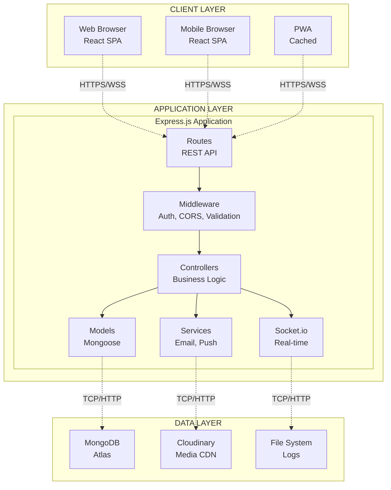
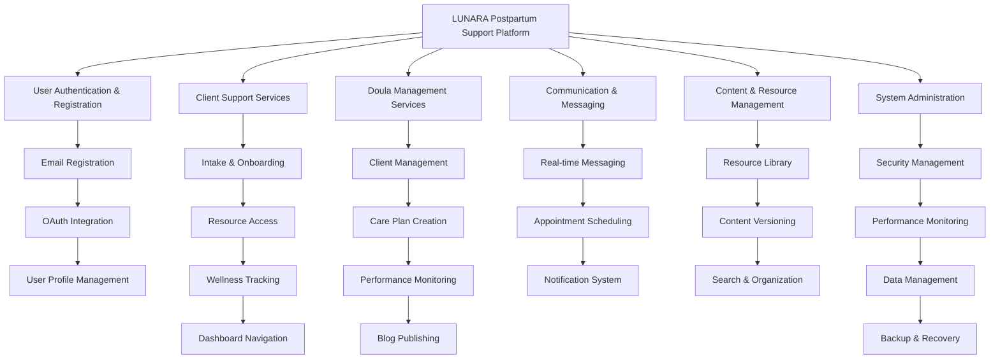
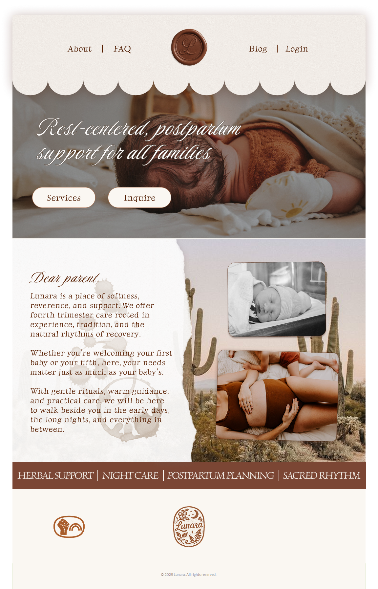
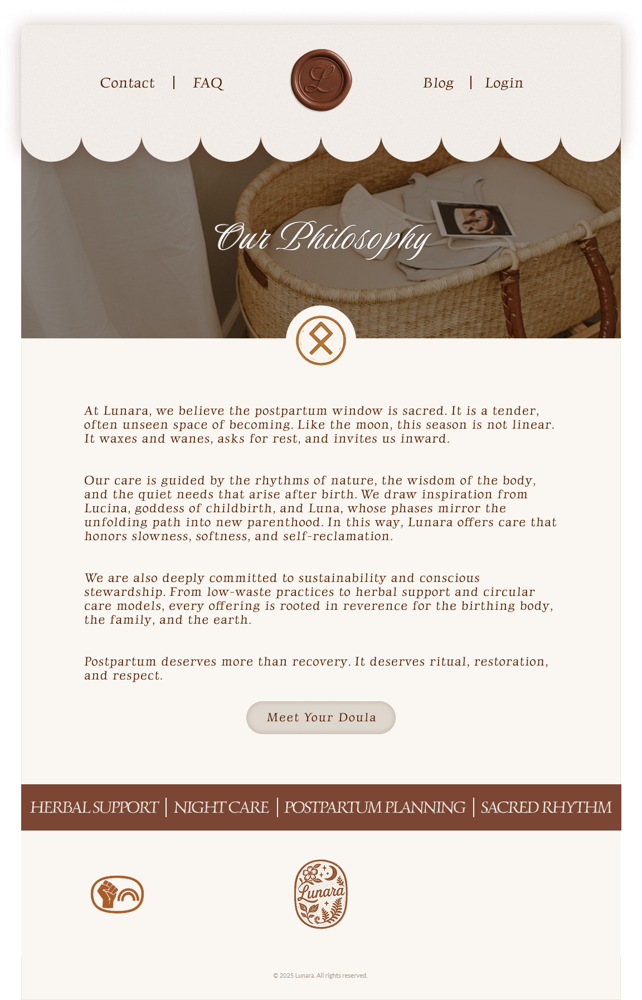
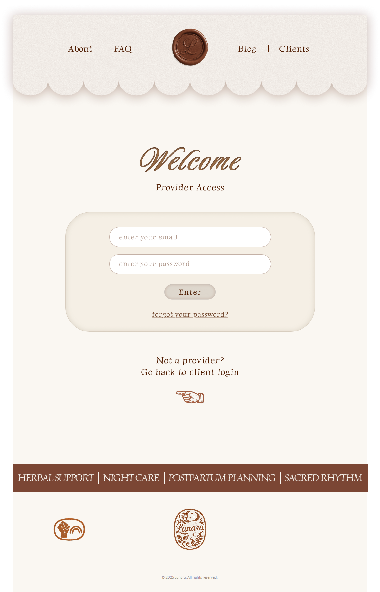
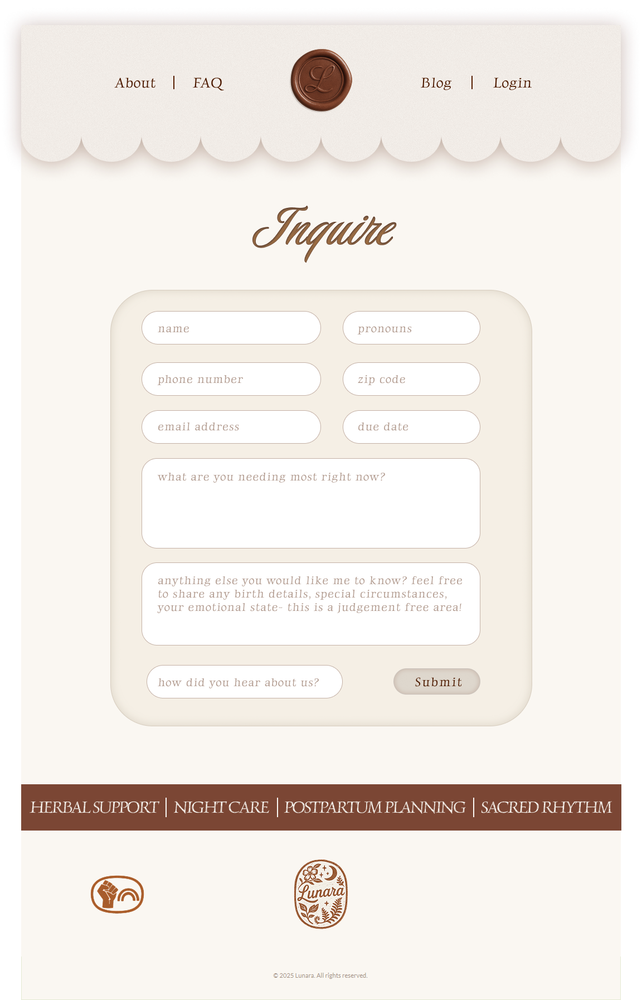
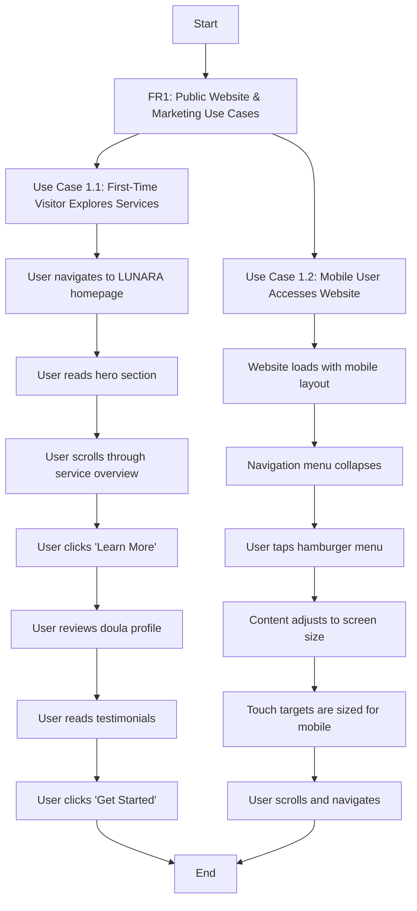

\newpage

# PROJECT OVERVIEW

## Abstract

LUNARA is a comprehensive postpartum support platform designed to provide new parents with a digital sanctuary during their fourth trimester journey. The platform combines secure client management, personalized resources, and direct communication with doula support services. This project addresses the critical need for accessible, personalized postpartum care by creating a web-based platform that serves both clients seeking support and doulas providing care.

The system features secure authentication with OAuth integration, dynamic intake forms, personalized resource libraries, real-time messaging with push notifications, appointment scheduling, mood tracking, and unique features like daily "New Mama Horoscopes." For doulas, it provides comprehensive client management tools, template systems for care plans, and blog publishing capabilities. The platform prioritizes security, mobile responsiveness, and user experience while maintaining appropriate data protection for sensitive health information.

The completed platform will serve as a bridge between traditional doula services and modern digital accessibility, ensuring consistent, personalized care for new parents during their most vulnerable postpartum period.

**Terms Reference:** *Fourth Trimester, Doula, Postpartum* (see **GLOSSARY** sections D, F, P); *OAuth, Authentication* (see **GLOSSARY** sections O, A); *UI, UX* (see **ABBREVIATIONS & ACRONYMS**); *User Experience* (see **TECHNICAL TERMS REFERENCE - Quality Assurance**)

\newpage

# LUNARA PLATFORM USE CASES

## FUNCTIONAL REQUIREMENTS USE CASES

### FR1: Public Website & Marketing Use Cases

#### Use Case 1.1: First-Time Visitor Explores Services
**Actor:** Prospective Client (New Parent)
**Preconditions:** User has internet access and visits LUNARA website
**Main Flow:**
1. User navigates to LUNARA homepage
2. User reads hero section describing postpartum support services
3. User scrolls through service overview section
4. User clicks "Learn More" to view detailed service descriptions
5. User reviews doula profile and credentials
6. User reads testimonials and success stories
7. User clicks "Get Started" call-to-action button

**Postconditions:** User understands LUNARA services and is ready to register
**Alternative Flows:**
- 3a. User immediately clicks contact form to ask questions
- 5a. User wants to read blog posts first before committing
  
\vspace{0.5cm}

#### Use Case 1.2: Mobile User Accesses Website
**Actor:** Prospective Client on Mobile Device
**Preconditions:** User accesses website via mobile browser
**Main Flow:**
1. Website loads with mobile-optimized layout
2. Navigation menu collapses to hamburger menu
3. User taps hamburger menu to view navigation options
4. Content automatically adjusts to screen size
5. Touch targets are appropriately sized for mobile interaction
6. User can easily scroll and navigate without zooming

**Postconditions:** User has seamless mobile experience

\newpage

### FR2: Secure User Authentication & Registration Use Cases

#### Use Case 2.1: New User Email Registration
**Actor:** New Parent
**Preconditions:** User has valid email address
**Main Flow:**
1. User clicks "Register" on homepage
2. System displays registration form
3. User enters email address and creates password
4. System validates email format and password strength
5. User selects role (Client)
6. System creates user account with unverified status
7. System sends verification email
8. User clicks verification link in email
9. System marks account as verified and logs user in

**Postconditions:** User has verified account and is logged in
**Exception Flows:**
- 4a. Invalid email format - system shows error message
- 4b. Weak password - system shows password requirements
- 7a. Email delivery fails - system provides resend option
  
\vspace{0.5cm}

#### Use Case 2.2: OAuth Google Registration
**Actor:** New Parent with Google Account
**Preconditions:** User has active Google account
**Main Flow:**
1. User clicks "Sign up with Google" button
2. System redirects to Google OAuth consent screen
3. User grants permissions to LUNARA
4. Google returns authentication token to LUNARA
5. System creates local user account linked to Google profile
6. System logs user in automatically
7. System redirects to user dashboard

**Postconditions:** User has account linked to Google and is logged in
**Exception Flows:**
- 3a. User denies permissions - redirected back to registration page
- 4a. Google service unavailable - system shows error and email backup option

\newpage

### FR3: User Dashboard & Navigation Use Cases

#### Use Case 3.1: Client Dashboard Overview
**Actor:** Authenticated Client
**Preconditions:** User is logged in with completed profile
**Main Flow:**
1. System loads personalized client dashboard
2. Dashboard displays welcome message with user's name
3. System calculates and shows current postpartum week
4. Dashboard shows quick access tiles for main features
5. Activity feed displays recent messages and appointments
6. System shows progress indicators for incomplete tasks
7. Dashboard provides contextual tips based on postpartum phase

**Postconditions:** User has overview of account status and next actions

\vspace{0.5cm}

#### Use Case 3.2: Mobile Dashboard Navigation
**Actor:** Client on Mobile Device
**Preconditions:** User is logged in on mobile browser
**Main Flow:**
1. Dashboard loads with mobile-optimized layout
2. Navigation shows bottom tab bar for main sections
3. User taps different tabs to switch between features
4. Each section maintains mobile-friendly interface
5. Touch interactions are responsive and intuitive

**Postconditions:** User can easily navigate all features on mobile

\newpage

### FR4: Dynamic Intake & Onboarding Forms Use Cases

#### Use Case 4.1: Complete Intake Process
**Actor:** New Client
**Preconditions:** User has registered account
**Main Flow:**
1. System presents intake form introduction
2. User begins multi-step form with progress indicator
3. System shows conditional fields based on previous answers
4. User answers questions about birth experience
5. System automatically saves progress after each section
6. User specifies feeding preferences and support needs
7. System validates required fields before allowing progression
8. User reviews and submits completed intake form
9. System marks intake as complete and updates user profile

**Postconditions:** User profile is complete and personalized experience begins
**Alternative Flows:**
- 5a. User pauses mid-form - progress is saved and can be resumed later
- 7a. Missing required fields - system highlights and explains what's needed

\newpage

### FR5: Real-time Secure Messaging Use Cases

#### Use Case 5.1: Send Message to Doula
**Actor:** Client
**Preconditions:** User has assigned doula
**Main Flow:**
1. User navigates to messaging section
2. System loads conversation thread with assigned doula
3. User types message in text input field
4. User optionally attaches file or image
5. User clicks send button
6. System encrypts and delivers message via WebSocket
7. System shows delivery confirmation
8. Doula receives real-time notification
9. System updates conversation thread for both parties

**Postconditions:** Message is delivered and conversation updated
**Alternative Flows:**
- 6a. Connection lost - system queues message and retries
- 8a. Doula offline - system sends push notification
- 
\vspace{0.5cm}

#### Use Case 5.2: Receive Offline Message Notification
**Actor:** Client (Offline)
**Preconditions:** User is not actively using application
**Main Flow:**
1. Doula sends message to client
2. System detects client is offline
3. System triggers push notification to client's device
4. Client receives notification on device
5. Client taps notification to open application
6. System loads conversation with new message highlighted

**Postconditions:** User is aware of new message and can respond

\newpage

### FR6: Appointment Scheduling & Management Use Cases

#### Use Case 6.1: Schedule New Appointment
**Actor:** Client
**Preconditions:** User has assigned doula with available time slots
**Main Flow:**
1. User navigates to appointment scheduling
2. System displays calendar view with available slots
3. User selects preferred date and time
4. System shows appointment details form
5. User specifies appointment type (virtual/in-person)
6. User adds any special notes or requirements
7. User submits appointment request
8. System sends request to doula for confirmation
9. System sends confirmation email to both parties
10. Calendar is updated with new appointment

**Postconditions:** Appointment is scheduled and both parties notified
**Exception Flows:**
- 8a. Doula declines - system notifies client and suggests alternatives
- 2a. No available slots - system offers to join waitlist

\newpage

### FR7: Personalized Resource Library Use Cases

#### Use Case 7.1: Browse Personalized Resources
**Actor:** Client
**Preconditions:** User has completed intake form
**Main Flow:**
1. User navigates to resource library
2. System analyzes user profile and preferences
3. System displays personalized resource recommendations
4. User browses resources by category (nutrition, body care, etc.)
5. User previews resource content before full access
6. User saves favorite resources to personal collection
7. System tracks resource usage for future recommendations

**Postconditions:** User accesses relevant resources for their situation
**Alternative Flows:**
- 4a. User searches for specific topic instead of browsing categories
- 6a. User shares resource with their doula for discussion

\newpage

### FR8: Daily Check-ins & Mood Tracking Use Cases

#### Use Case 8.1: Complete Daily Wellness Check-in
**Actor:** Client
**Preconditions:** User is in postpartum period
**Main Flow:**
1. System sends daily check-in notification
2. User opens check-in prompt
3. User rates overall mood on 1-10 scale
4. User selects current physical symptoms from checklist
5. User optionally adds notes about their day
6. System saves check-in data
7. System updates wellness trends and visualizations
8. System alerts doula if concerning patterns detected

**Postconditions:** Daily wellness data is recorded and analyzed
**Alternative Flows:**
- 1a. User manually initiates check-in without notification
- 8a. Positive trends trigger congratulatory message

\newpage

### FR9: Doula Client Management Dashboard Use Cases

#### Use Case 9.1: Review Client Status Overview
**Actor:** Doula
**Preconditions:** Doula has assigned clients
**Main Flow:**
1. Doula logs in and navigates to client dashboard
2. System displays list of all assigned clients
3. Dashboard shows status indicators for each client
4. Doula views recent wellness check-in summaries
5. System highlights clients requiring attention
6. Doula clicks on specific client for detailed view
7. Detailed view shows full client history and communication

**Postconditions:** Doula has comprehensive view of client status
**Alternative Flows:**
- 5a. No clients need immediate attention - dashboard shows all clear status
- 6a. Doula uses quick action buttons for common tasks

\newpage

### FR10: Care Plan Template System Use Cases

#### Use Case 10.1: Create Customized Care Plan
**Actor:** Doula
**Preconditions:** Doula has client requiring care plan
**Main Flow:**
1. Doula navigates to care plan creation
2. System displays available template categories
3. Doula selects appropriate base template
4. System loads template with editable sections
5. Doula customizes sections for specific client needs
6. Doula adds client-specific resources and milestones
7. Doula assigns care plan to client
8. System notifies client of new care plan
9. Client receives access to personalized care plan

**Postconditions:** Client has customized care plan based on their needs

\newpage

### FR11: Blog Publishing Platform Use Cases

#### Use Case 11.1: Publish New Blog Post
**Actor:** Doula
**Preconditions:** Doula has content to share
**Main Flow:**
1. Doula navigates to blog editor
2. System opens rich text editor interface
3. Doula writes blog post content with formatting
4. Doula adds images and media as needed
5. Doula adds SEO metadata (title, description, tags)
6. Doula saves draft for review
7. Doula publishes post when ready
8. System makes post publicly available
9. System notifies clients of new blog post

**Postconditions:** Blog post is published and accessible to clients

\newpage

## NON-FUNCTIONAL REQUIREMENTS USE CASES

### NFR1: Data Security & Privacy Use Cases

#### Use Case NFR1.1: Secure Data Transmission
**Actor:** Any User
**Preconditions:** User is interacting with LUNARA platform
**Main Flow:**
1. User initiates any action requiring data transmission
2. System establishes HTTPS/TLS 1.3 encrypted connection
3. All data is encrypted before transmission
4. System validates SSL certificate authenticity
5. Data is transmitted through secure channel
6. System logs security events for monitoring

**Postconditions:** All data transmission is encrypted and secure
**Success Criteria:** 100% of communications use HTTPS/TLS 1.3
**Verification:** Security audit confirms no unencrypted data transmission

\vspace{0.5cm}

#### Use Case NFR1.2: Password Security Handling
**Actor:** System
**Preconditions:** User attempts to create or update password
**Main Flow:**
1. System receives password from user input
2. System validates password meets strength requirements
3. System applies bcrypt hashing with salt
4. System stores only hashed password, never plaintext
5. System clears password from memory
6. System logs authentication attempt (without password data)

**Postconditions:** Password is securely stored and protected
**Success Criteria:** Zero plaintext passwords stored in system
**Verification:** Database audit confirms all passwords are properly hashed

\newpage

### NFR2: Mobile Responsiveness Use Cases

#### Use Case NFR2.1: Responsive Layout Adaptation
**Actor:** Mobile User
**Preconditions:** User accesses platform from mobile device
**Main Flow:**
1. User opens LUNARA on mobile browser
2. System detects device screen size and capabilities
3. CSS Grid and Flexbox adapt layout automatically
4. Touch targets resize to minimum 44px for usability
5. Text and images scale appropriately
6. Navigation adjusts to mobile-friendly patterns
7. Performance optimizes for mobile network speeds

**Postconditions:** Interface is fully functional on mobile device
**Success Criteria:** All features accessible with touch interface
**Verification:** Testing on various mobile devices and screen sizes

\vspace{0.5cm}

#### Use Case NFR2.2: Cross-Browser Compatibility
**Actor:** User with Different Browser
**Preconditions:** User accesses platform from Chrome, Firefox, Safari, or Edge
**Main Flow:**
1. User opens LUNARA in their preferred browser
2. System serves browser-optimized assets
3. All functionality works consistently across browsers
4. Visual design maintains consistency
5. Performance remains within acceptable ranges
6. JavaScript features function properly

**Postconditions:** Consistent experience regardless of browser choice
**Success Criteria:** 100% feature parity across supported browsers
**Verification:** Automated cross-browser testing suite

\newpage

### NFR3: System Reliability & Performance Use Cases

#### Use Case NFR3.1: High Availability Monitoring
**Actor:** System Monitoring Service
**Preconditions:** LUNARA platform is deployed and operational
**Main Flow:**
1. Monitoring service checks system health every minute
2. System responds to health check requests
3. Performance metrics are collected and analyzed
4. Any downtime is immediately detected
5. Alert notifications are sent to development team
6. Automated recovery procedures initiate if possible
7. System maintains 99.5% uptime target

**Postconditions:** System availability is monitored and maintained
**Success Criteria:** Uptime exceeds 99.5% monthly average
**Verification:** Monitoring dashboard shows uptime statistics

\vspace{0.5cm}

#### Use Case NFR3.2: Performance Optimization
**Actor:** System
**Preconditions:** User requests page or API data
**Main Flow:**
1. User initiates request for page or data
2. System processes request efficiently
3. Database queries are optimized with proper indexing
4. Static assets are served from CDN
5. Response is compressed before transmission
6. Page loads within 3-second target
7. API responds within 1-second target

**Postconditions:** User receives fast, responsive experience
**Success Criteria:** Page loads <3s, API responses <1s
**Verification:** Performance monitoring and Lighthouse scores

\newpage

### NFR4: Real-time Communication Use Cases

#### Use Case NFR4.1: WebSocket Connection Management
**Actor:** User Messaging System
**Preconditions:** Users need real-time messaging capability
**Main Flow:**
1. User opens messaging interface
2. System establishes WebSocket connection
3. Connection heartbeat maintains active link
4. Messages are delivered instantly when connection is active
5. System handles connection drops gracefully
6. Automatic reconnection attempts with exponential backoff
7. Message queue ensures delivery when connection restored

**Postconditions:** Reliable real-time messaging is available
**Success Criteria:** Messages delivered within 500ms when online
**Verification:** Real-time communication testing and monitoring

\vspace{0.5cm}

#### Use Case NFR4.2: Offline Notification Delivery
**Actor:** Push Notification System
**Preconditions:** User is offline but needs to receive messages
**Main Flow:**
1. Message is sent to offline user
2. System detects user offline status
3. Push notification service is triggered
4. Notification is delivered to user's device
5. User receives notification even when app is closed
6. User can tap notification to return to conversation
7. Message is marked as delivered when user reads it

**Postconditions:** Users receive notifications even when offline
**Success Criteria:** 95% notification delivery rate
**Verification:** Push notification analytics and user feedback

\newpage

### NFR5: Scalability & Growth Use Cases

#### Use Case NFR5.1: Database Performance Under Load
**Actor:** Database System
**Preconditions:** System experiences increased user activity
**Main Flow:**
1. Multiple users access system simultaneously
2. Database handles concurrent connections efficiently
3. Query performance remains consistent with proper indexing
4. Connection pooling manages database connections
5. Response times stay within acceptable limits
6. System scales horizontally if needed
7. Performance metrics are monitored continuously

**Postconditions:** System performs well under increased load
**Success Criteria:** Response times remain <1s with 10x user growth
**Verification:** Load testing and performance benchmarking

\newpage

### NFR6: User Experience & Accessibility Use Cases

#### Use Case NFR6.1: Screen Reader Accessibility
**Actor:** Visually Impaired User with Screen Reader
**Preconditions:** User accesses LUNARA with assistive technology
**Main Flow:**
1. User navigates to LUNARA with screen reader active
2. Screen reader announces page title and main heading
3. User navigates using heading structure
4. All interactive elements have proper labels
5. Form inputs have associated labels and instructions
6. Error messages are announced clearly
7. User can complete all tasks using only keyboard navigation

**Postconditions:** User can fully access and use all platform features
**Success Criteria:** WCAG 2.1 AA compliance achieved
**Verification:** Accessibility audit with assistive technology testing

\vspace{0.5cm}

#### Use Case NFR6.2: Keyboard Navigation
**Actor:** User Unable to Use Mouse
**Preconditions:** User relies on keyboard for navigation
**Main Flow:**
1. User accesses LUNARA using only keyboard
2. Tab order follows logical page structure
3. All interactive elements are reachable via keyboard
4. Focus indicators are clearly visible
5. Skip navigation links allow efficient movement
6. Modal dialogs trap focus appropriately
7. User can complete all tasks without mouse

**Postconditions:** Full functionality available via keyboard
**Success Criteria:** 100% keyboard accessibility
**Verification:** Manual keyboard navigation testing

\newpage

### NFR7: Data Backup & Recovery Use Cases

#### Use Case NFR7.1: Automated Daily Backup
**Actor:** Backup System
**Preconditions:** System is operational with user data
**Main Flow:**
1. Daily backup process initiates automatically
2. System creates full database snapshot
3. Backup is encrypted before storage
4. Backup is transferred to secure storage location
5. Backup integrity is verified
6. Previous backups are managed according to retention policy
7. Backup completion is logged and monitored

**Postconditions:** Daily backup is completed and verified
**Success Criteria:** 100% successful daily backups
**Verification:** Backup logs and integrity verification reports

\vspace{0.5cm}

#### Use Case NFR7.2: Data Recovery Process
**Actor:** System Administrator
**Preconditions:** Data loss event has occurred
**Main Flow:**
1. Data loss is detected and confirmed
2. Administrator accesses backup storage
3. Most recent viable backup is identified
4. Recovery process is initiated
5. Data is restored from backup
6. System integrity is verified post-recovery
7. Users are notified of recovery completion

**Postconditions:** System is restored with minimal data loss
**Success Criteria:** Recovery completed within 4 hours
**Verification:** Disaster recovery testing scenarios

\newpage

### NFR8: Integration Capability Use Cases

#### Use Case NFR8.1: External API Integration
**Actor:** LUNARA System
**Preconditions:** External service integration is required
**Main Flow:**
1. System needs to integrate with external service (email, calendar)
2. API credentials are configured securely
3. RESTful endpoints are established
4. Data exchange formats are standardized
5. Error handling manages API failures gracefully
6. Rate limiting prevents service abuse
7. Integration status is monitored continuously

**Postconditions:** External service is successfully integrated
**Success Criteria:** 99% API call success rate
**Verification:** Integration testing and monitoring dashboards

\newpage

### NFR9: Content Management Use Cases

#### Use Case NFR9.1: Content Version Control
**Actor:** Content Editor (Doula)
**Preconditions:** Content needs to be updated or modified
**Main Flow:**
1. Editor opens content for modification
2. System creates version snapshot before changes
3. Editor makes content modifications
4. Changes are saved with version metadata
5. Previous versions remain accessible
6. Editor can revert to previous version if needed
7. Change history is maintained for audit purposes

**Postconditions:** Content changes are tracked and reversible
**Success Criteria:** Complete version history maintained
**Verification:** Content versioning functionality testing

\newpage

### NFR10: Monitoring & Analytics Use Cases

#### Use Case NFR10.1: Performance Monitoring
**Actor:** Monitoring System
**Preconditions:** Platform is operational and serving users
**Main Flow:**
1. Monitoring system collects performance metrics continuously
2. Response times, error rates, and resource usage are tracked
3. Metrics are analyzed for trends and anomalies
4. Alerts are triggered when thresholds are exceeded
5. Dashboards provide real-time system status
6. Historical data enables capacity planning
7. Performance reports are generated regularly

**Postconditions:** System performance is continuously monitored
**Success Criteria:** 24/7 monitoring with <5 minute alert response
**Verification:** Monitoring dashboard and alert testing

\vspace{0.5cm}

#### Use Case NFR10.2: User Analytics Collection
**Actor:** Analytics System
**Preconditions:** Users are actively using the platform
**Main Flow:**
1. User interactions are tracked anonymously
2. Feature usage patterns are recorded
3. User journey paths are mapped
4. Performance bottlenecks are identified
5. Analytics data is aggregated and reported
6. Insights guide product improvement decisions
7. Privacy regulations are strictly followed

**Postconditions:** User behavior insights are available for optimization
**Success Criteria:** Comprehensive usage analytics without privacy violations
**Verification:** Analytics reports and privacy compliance audit

\newpage

## USE CASE CROSS-REFERENCE MATRIX

| Functional Requirement | Primary Use Cases | Supporting NFR Use Cases |
|------------------------|-------------------|-------------------------|
| FR1 - Public Website | 1.1, 1.2 | NFR2.1, NFR2.2, NFR3.2 |
| FR2 - Authentication | 2.1, 2.2 | NFR1.1, NFR1.2, NFR3.1 |
| FR3 - User Dashboard | 3.1, 3.2 | NFR2.1, NFR6.1, NFR6.2 |
| FR4 - Intake Forms | 4.1 | NFR2.1, NFR6.1, NFR7.1 |
| FR5 - Messaging | 5.1, 5.2 | NFR1.1, NFR4.1, NFR4.2 |
| FR6 - Scheduling | 6.1 | NFR8.1, NFR7.1, NFR10.2 |
| FR7 - Resources | 7.1 | NFR5.1, NFR9.1, NFR10.2 |
| FR8 - Check-ins | 8.1 | NFR7.1, NFR10.1, NFR10.2 |
| FR9 - Doula Dashboard | 9.1 | NFR6.1, NFR10.1, NFR5.1 |
| FR10 - Care Plans | 10.1 | NFR9.1, NFR7.1, NFR8.1 |
| FR11 - Blog Platform | 11.1 | NFR9.1, NFR2.1, NFR3.2 |

\newpage

## Functional Requirements

The following functional requirements define the core capabilities that the LUNARA platform must provide to support both clients (new parents) and service providers (doulas).

| ID  | Functional Requirement | Description | Acceptance Criteria | Priority |
|-----|----------------------|-------------|-------------------|----------|
| FR1 | **Public Website & Marketing** | Static website with information about services, doula profiles, and initial blog content to establish credibility and drive user acquisition. | Responsive landing page with service descriptions, doula biography and credentials, contact information and inquiry form, initial blog posts (static content), SEO optimization for local search, mobile-optimized design, fast loading times (<2 seconds) | High |
| FR2 | **Secure User Authentication & Registration** | Multi-method authentication system allowing email/password registration and OAuth integration with Google/Apple, all creating unified user accounts. | Email/password registration with validation, OAuth integration (Google/Apple) creating local user records, JWT-based session management with refresh tokens, role-based access control (Client, Doula, Admin), account linking for multiple auth methods, password reset functionality, email verification for new accounts | High |
| FR3 | **User Dashboard & Navigation** | Role-based dashboards providing personalized interfaces for clients and doulas with intuitive navigation between platform features. | Personalized welcome with user's name and current postpartum week (clients), quick access navigation to all platform features, role-based UI showing appropriate features only, mobile responsive design across all devices, activity feeds showing recent interactions, contextual help and onboarding for new users | High |
| FR4 | **Dynamic Intake & Onboarding Forms** | Clients complete comprehensive, mobile-optimized intake forms that adapt based on previous responses and save progress automatically. | Multi-step form with visual progress indicator, conditional field display based on previous answers, automatic progress saving between sections, mobile-friendly input controls and validation, form validation with helpful, contextual error messages, ability to return and edit previously completed sections | High |
| FR5 | **Real-time Secure Messaging** | Users can send and receive encrypted messages with their assigned doula, including file attachments, read receipts, and push notifications when offline. | Thread-based conversation organization, WebSocket implementation for real-time delivery, push notifications for offline users, read receipts and delivery confirmation, file and image attachment capability (max 10MB), message search and filtering functionality, message encryption for data protection | High |

\vspace{0.5cm}

| ID  | Functional Requirement | Description | Acceptance Criteria | Priority |
|-----|----------------------|-------------|-------------------|----------|
| FR6 | **Appointment Scheduling & Management** | Clients can view available appointment slots, request bookings, and receive automated reminders via email and push notifications. | Interactive calendar view of available time slots, appointment request and confirmation workflow, automated email and push notification reminders, rescheduling and cancellation functionality, calendar export option (iCal format), appointment history and notes access, doula availability management | High |
| FR7 | **Personalized Resource Library** | The platform delivers a curated resource library with content recommendations based on user profiles, birth experience, feeding preferences, and recovery phase. | Categorized resources by type (nutrition, body care, infant care, mental health, relationships, printables), personalized recommendations based on user profile, search and filter functionality, ability to save favorite resources, resource preview cards with key information, downloadable guides and printable materials | Medium |
| FR8 | **Daily Check-ins & Mood Tracking** | The platform enables daily wellness check-ins with mood tracking, physical symptom logging, and trend visualization. | Daily prompt notifications for check-in completion, simple emotional well-being scale (1-10), physical symptom tracking with predefined options, weekly and monthly trend visualization, option to share results directly with assigned doula, historical data export capability, alerts for concerning patterns | Medium |
| FR9 | **Doula Client Management Dashboard** | Doulas can access comprehensive client overviews, upcoming sessions, wellness summaries, and administrative tools. | Client list with status indicators and recent activity, upcoming appointment calendar with client details, wellness check-in summaries and alerts, client communication history and notes, quick access to client resources and care plans, appointment scheduling and management tools, client progress tracking and reporting | Medium |
| FR10 | **Care Plan Template System** | Doulas can create, customize, and assign templated care plans and resource bundles to clients based on their specific needs. | Pre-built care plan templates for common scenarios, customizable template components and sections, drag-and-drop template builder interface, resource bundle creation and assignment, template sharing between doulas (with permission), client-specific template customization, progress tracking against care plan milestones | Medium |

\vspace{0.5cm}

| ID  | Functional Requirement | Description | Acceptance Criteria | Priority |
|-----|----------------------|-------------|-------------------|----------|
| FR11 | **Blog Publishing Platform** | Doulas can create, edit, and publish blog posts that are publicly viewable, with content management and SEO optimization features. | Rich text blog post editor with media support, draft saving and publishing workflow, SEO optimization tools (meta descriptions, tags, titles), public blog view with responsive design, comment moderation system, blog post categorization and tagging, social media sharing integration, blog analytics and readership tracking | Medium |
| FR12 | **Digital Journaling Platform** | A private journaling space with guided prompts, media attachments, and milestone tracking capabilities. | Rich text editor with formatting options, optional guided prompts based on postpartum phase, photo and video attachment support, calendar view of journal entries, private by default with optional sharing to doula, milestone tracking and celebration features, entry export functionality for personal records | Low |
| FR13 | **New Mama Horoscope & Daily Insights** | Users receive personalized daily horoscopes combining astrological elements with practical postpartum guidance and baby development insights. | Daily updated content based on user's birth date and baby's age, personalized mood/energy forecasts, journal prompts and affirmation suggestions, baby development and behavior predictions, toggle between "whimsical" and "practical" content modes, shareable content for social media, integration with user's current postpartum phase | Low |
| FR14 | **Sleep & Feeding Trackers** | Optional tracking tools allow parents to monitor and log baby's sleep patterns, feeding schedules, and related data. | Intuitive data entry interface with minimal clicks, timeline visualization of sleep and feeding patterns, automatic pattern identification and insights, data export and sharing capability with doula, customizable tracking categories, weekly summary reports | Low |
| FR15 | **AI-Powered Note Summarization** | Doulas can convert session notes into structured follow-ups, care recommendations, and resource suggestions using AI assistance. | Voice-to-text note transcription, AI-powered summary generation from session notes, automatic action item extraction, suggested follow-up resources based on session content, template generation for care plans, integration with client messaging for follow-up delivery, note categorization and tagging system | Future |

**Terms Reference:** *Client, Doula* (see **GLOSSARY** sections C, D); *OAuth, Authentication, JWT* (see **GLOSSARY** sections O, A, J); *WebSocket, Push Notification* (see **GLOSSARY** sections W, P); *UI* (see **ABBREVIATIONS & ACRONYMS**); *User Story* (see **TECHNICAL TERMS REFERENCE - Development Methodologies**)

\newpage

## Non-Functional Requirements

### System Quality Requirements

The following non-functional requirements define the quality attributes and constraints that the LUNARA platform must meet to ensure reliable, secure, and performant operation.

| ID | Non-Functional Requirement | Description | Implementation Guidelines | Priority |
|----|---------------------------|-------------|--------------------------|----------|
| NFR1 | **Data Security & Privacy** | The platform implements comprehensive security measures for all data transmission and storage, with appropriate protection for sensitive health information. | HTTPS/TLS 1.3 for all connections, bcrypt password hashing, JWT tokens with proper expiration and refresh, secure file upload handling, input validation and sanitization, regular security audits, protection against common vulnerabilities (XSS, CSRF, SQL injection) | High |
| NFR2 | **Mobile Responsiveness** | The application interface provides optimal user experience across all device types, screen sizes, and orientations. | Mobile-first responsive design using CSS Grid and Flexbox, touch-optimized interface elements, Progressive Web App (PWA) capabilities, cross-browser compatibility (Chrome, Firefox, Safari, Edge), accessibility compliance (WCAG 2.1 AA), performance optimization for mobile networks | High |
| NFR3 | **System Reliability & Performance** | The platform maintains high availability with fast response times and robust error handling. | 99.5% uptime target with monitoring, page load times under 3 seconds, API response times under 1 second, graceful error handling and user feedback, comprehensive error logging, automated health checks | High |
| NFR4 | **Real-time Communication** | Messaging and notifications work reliably with minimal delay, including offline notification delivery. | WebSocket connections for real-time messaging, push notification service integration, connection fallback and retry logic, message queuing for offline users, delivery confirmation and read receipts, notification preference management | High |
| NFR5 | **Scalability & Growth** | The system architecture supports growing user bases and content volume without significant performance degradation. | Horizontal scaling capabilities with cloud infrastructure, database indexing and query optimization, efficient file storage and CDN usage, API rate limiting and resource management, caching strategies for frequently accessed content | Medium |

\vspace{0.5cm}

| ID | Non-Functional Requirement | Description | Implementation Guidelines | Priority |
|----|---------------------------|-------------|--------------------------|----------|
| NFR6 | **User Experience & Accessibility** | The platform provides an intuitive, accessible user experience that accommodates users with varying technical skills and abilities. | Intuitive navigation and information architecture, WCAG 2.1 AA accessibility compliance, screen reader compatibility and keyboard navigation, context-sensitive help and documentation, progressive disclosure of complex features, consistent design patterns throughout | Medium |
| NFR7 | **Data Backup & Recovery** | Automated backup systems ensure data protection and enable recovery from system failures or data loss. | Daily automated database backups, secure backup storage, point-in-time recovery capabilities, regular backup integrity testing, documented recovery procedures, data retention policies (daily for 30 days, weekly for 1 year) | Medium |
| NFR8 | **Integration Capability** | The platform supports integration with external services and APIs commonly used in healthcare and wellness. | RESTful API design for external integrations, email service provider integration, push notification service integration, calendar service integration (Google Calendar), standardized data export formats (JSON, CSV, PDF), webhook support for real-time updates | Medium |
| NFR9 | **Content Management** | Efficient content creation, editing, and management tools support dynamic resource libraries and blog publishing. | Version control for content updates, content scheduling and publication workflows, SEO optimization tools and guidance, content categorization and tagging systems, media library management with optimization, WYSIWYG editor for non-technical users | Low |
| NFR10 | **Monitoring & Analytics** | System monitoring and user analytics provide insights for optimization and improvement. | Application performance monitoring, error tracking and automated notification, user behavior analytics and reporting, system health dashboards, usage statistics and trend analysis, custom reporting capabilities | Low |

**Terms Reference:** *HTTPS, TLS, bcrypt, JWT, XSS, CSRF* (see **GLOSSARY** sections H, T, B, J, X, C); *PWA, CSS, WCAG, API, CDN, REST* (see **ABBREVIATIONS & ACRONYMS**); *WYSIWYG* (see **GLOSSARY** section W); *Component-Based Architecture, RESTful API* (see **TECHNICAL TERMS REFERENCE - Architecture Patterns**)

\newpage

# TECHNICAL ARCHITECTURE

## Technology Stack

| Category | Technology | Purpose | Justification |
|----------|------------|---------|---------------|
| **Frontend Framework** | **React 18 with Vite** | Fast, modern frontend development with excellent DX | Superior development experience, fast HMR, optimized builds |
| **Frontend Styling** | **CSS Modules + SCSS** | Scoped, maintainable styling with advanced features | Component-scoped styles, variables, mixins, responsive design |
| **Backend Framework** | **Express.js (Node.js)** | Lightweight, flexible API server | JavaScript ecosystem consistency, extensive middleware |
| **Database** | **MongoDB with Mongoose** | Document-based storage with ODM | Flexible schemas, excellent Node.js integration, easy scaling |
| **Real-time Communication** | **Socket.io** | WebSocket implementation for messaging | Reliable real-time communication with fallbacks |
| **Authentication** | **Passport.js + JWT** | Multi-strategy authentication | OAuth integration, secure session management |
| **File Storage** | **Cloudinary** | Image/file upload and optimization | CDN delivery, automatic optimization, generous free tier |
| **Push Notifications** | **Web Push API** | Browser push notifications | Native browser support, no third-party dependencies initially |
| **Email Service** | **Nodemailer + Gmail SMTP** | Transactional emails | Cost-effective, reliable, easy setup |
| **Frontend Deployment** | **Vercel** | Static site hosting with edge functions | Excellent React/Vite support, automatic deployments |
| **Backend Deployment** | **Render** | Container-based backend hosting | Free tier, automatic deployments, easy scaling |
| **Database Hosting** | **MongoDB Atlas** | Managed MongoDB hosting | Free tier, automatic backups, global distribution |

\vspace{1cm}

## System Architecture



\vspace{1cm}

## Component Details

| Layer | Component | Technology | Purpose |
|-------|-----------|------------|---------|
| **Client** | Web Browser | React SPA | Primary web interface |
| **Client** | Mobile Browser | React SPA | Mobile web interface |
| **Client** | PWA | Cached | Offline-capable app |
| **Application** | Routes | REST API | API endpoints |
| **Application** | Middleware | Auth, CORS, Validation | Request processing |
| **Application** | Controllers | Business Logic | Core application logic |
| **Application** | Socket.io | Real-time | Live updates |
| **Application** | Services | Email, Push | External integrations |
| **Application** | Models | Mongoose | Data modeling |
| **Data** | MongoDB | Atlas | Primary database |
| **Data** | Cloudinary | Media CDN | Asset storage |
| **Data** | File System | Logs | Application logs |

\newpage

## Database Schema Design

The MongoDB collections will be structured as follows:

### Users Collection
```javascript
{
  _id: ObjectId,
  email: String (unique),
  password: String (hashed), // null for OAuth-only users
  oauthProviders: [{
    provider: String, // 'google', 'apple'
    providerId: String,
    email: String
  }],
  role: String, // 'client', 'doula', 'admin'
  profile: {
    firstName: String,
    lastName: String,
    phone: String,
    timezone: String,
    preferences: Object
  },
  isEmailVerified: Boolean,
  createdAt: Date,
  updatedAt: Date
}
```

### Client Profiles Collection
```javascript
{
  _id: ObjectId,
  userId: ObjectId (ref: Users),
  birthDate: Date,
  babyBirthDate: Date,
  postpartumWeek: Number,
  birthExperience: Object,
  feedingPreferences: [String],
  assignedDoula: ObjectId (ref: Users),
  intakeCompleted: Boolean,
  intakeData: Object,
  createdAt: Date,
  updatedAt: Date
}
```

### Messages Collection
```javascript
{
  _id: ObjectId,
  conversationId: String,
  sender: ObjectId (ref: Users),
  recipient: ObjectId (ref: Users),
  content: String,
  attachments: [String], // Cloudinary URLs
  isRead: Boolean,
  readAt: Date,
  createdAt: Date
}
```

### Appointments Collection
```javascript
{
  _id: ObjectId,
  client: ObjectId (ref: Users),
  doula: ObjectId (ref: Users),
  scheduledDate: Date,
  duration: Number, // minutes
  type: String, // 'virtual', 'in-person'
  status: String, // 'requested', 'confirmed', 'completed', 'cancelled'
  notes: String,
  remindersSent: [Date],
  createdAt: Date,
  updatedAt: Date
}
```

**Terms Reference:** *React, Vite, DX, HMR, CSS, SCSS, Express.js, Node.js, MongoDB, Mongoose, Socket.io, Passport.js, JWT, Cloudinary, CDN, Vercel, Render* (see **GLOSSARY** sections R, V, D, H, C, S, E, N, M, S, P, J, C, C, V, R); *API, ODM, PWA, SPA, WSS, HTTPS, REST, CORS* (see **ABBREVIATIONS & ACRONYMS**); *Component-Based Architecture, RESTful API* (see **TECHNICAL TERMS REFERENCE - Architecture Patterns**)

\newpage

# PROJECT MANAGEMENT

## Sprint Planning & Timeline

### 20-Week Development Timeline (7 Sprints)

**Sprint Duration:** ~3 weeks each  
**Team:** 3 Full-stack developers  
**Total Capacity:** ~420 developer hours (20 weeks × 21 hours/week/developer)

### Sprint Breakdown

#### Sprint 1 (Weeks 1-3): Foundation & Public Website
**Goal:** Establish project foundation and public presence  
**Developer Focus:**
- **Owen:** Project setup, architecture, basic Express server
- **Carter:** Public website design and React components
- **Andrew:** CI/CD pipeline, deployment setup, database schema

**Deliverables:**
- [x] Project repository and development environment setup
- [x] Public website (FR1) - Static pages with doula information
- [x] Basic React application structure with routing
- [x] Express.js server with MongoDB connection
- [x] Deployment pipeline (Vercel + Render)
- [x] Basic authentication scaffolding

**Story Points:** 65 points

\vspace{0.5cm}

#### Sprint 2 (Weeks 4-6): Authentication & User Management
**Goal:** Complete user registration and authentication system  
**Developer Focus:**
- **Owen:** Authentication API, JWT implementation, OAuth setup
- **Carter:** Registration/login UI, form validation, user dashboard layouts
- **Andrew:** Security middleware, password reset system, email integration

**Deliverables:**
- [ ] User registration and login system (FR2)
- [ ] OAuth integration (Google/Apple)
- [ ] Email verification and password reset
- [ ] Basic role-based dashboards (FR3)
- [ ] Security middleware and validation
- [ ] User profile management

**Story Points:** 75 points

\vspace{0.5cm}

#### Sprint 3 (Weeks 7-9): Core Client Features
**Goal:** Essential client-facing functionality  
**Developer Focus:**
- **Owen:** Intake form API, data validation, client profile management
- **Carter:** Dynamic intake forms UI, progress tracking, dashboard completion
- **Andrew:** File upload system, data backup implementation

**Deliverables:**
- [ ] Dynamic intake and onboarding forms (FR4)
- [ ] Client dashboard with personalized content (FR3)
- [ ] File upload functionality
- [ ] Basic resource library structure (FR7)
- [ ] User profile completion flows

**Story Points:** 70 points

\vspace{0.5cm}

#### Sprint 4 (Weeks 10-12): Real-time Messaging
**Goal:** Complete messaging system with real-time capabilities  
**Developer Focus:**
- **Owen:** Socket.io implementation, message API, conversation management
- **Carter:** Messaging UI, real-time updates, mobile-optimized chat interface
- **Andrew:** Push notification setup, message encryption, offline handling

**Deliverables:**
- [ ] Real-time secure messaging system (FR5)
- [ ] Push notifications for offline users
- [ ] File attachment support
- [ ] Message read receipts and delivery confirmation
- [ ] Conversation management and search

**Story Points:** 80 points

\vspace{0.5cm}

#### Sprint 5 (Weeks 13-15): Scheduling & Resource Management
**Goal:** Appointment system and resource library  
**Developer Focus:**
- **Owen:** Appointment API, calendar integration, availability management
- **Carter:** Calendar UI, appointment booking flow, resource library interface
- **Andrew:** Email notifications, reminder system, resource categorization

**Deliverables:**
- [ ] Appointment scheduling and management (FR6)
- [ ] Interactive calendar interface
- [ ] Personalized resource library (FR7)
- [ ] Automated reminder system
- [ ] Resource recommendation engine

**Story Points:** 75 points

\vspace{0.5cm}

#### Sprint 6 (Weeks 16-18): Doula Portal & Content Management
**Goal:** Doula-specific features and content management  
**Developer Focus:**
- **Owen:** Doula dashboard API, client management system, care plan templates
- **Carter:** Doula portal UI, client overview interface, template builder
- **Andrew:** Blog publishing system, SEO optimization, analytics setup

**Deliverables:**
- [ ] Doula client management dashboard (FR9)
- [ ] Care plan template system (FR10)
- [ ] Blog publishing platform (FR11)
- [ ] Daily check-ins and mood tracking (FR8)
- [ ] Client progress tracking

**Story Points:** 85 points

\vspace{0.5cm}

#### Sprint 7 (Weeks 19-20): Polish & Launch Preparation
**Goal:** Final testing, optimization, and launch readiness  
**Developer Focus:**
- **Owen:** Performance optimization, security audit, documentation
- **Carter:** UI/UX polish, accessibility improvements, mobile optimization
- **Andrew:** Monitoring setup, error tracking, production preparation

**Deliverables:**
- [ ] Performance optimization and testing
- [ ] Security audit and penetration testing
- [ ] Accessibility compliance (WCAG 2.1 AA)
- [ ] Comprehensive documentation
- [ ] Production monitoring and alerting
- [ ] Launch preparation and go-live

**Story Points:** 50 points

\vspace{1cm}

## Features Roadmap

### Features Deferred to Post-Launch

**Future Phase 1 (After Launch):**
- Digital journaling platform (FR12)
- New Mama Horoscope feature (FR13)
- Sleep & feeding trackers (FR14)

**Future Phase 2 (AI Integration):**
- AI-powered note summarization (FR15)
- Advanced analytics and insights
- Machine learning recommendations

**Terms Reference:** *Sprint* (see **GLOSSARY** section S); *Express.js, React, MongoDB, Socket.io, OAuth, JWT* (see **GLOSSARY** sections E, R, M, S, O, J); *CI/CD, UI, UX, API, WCAG* (see **ABBREVIATIONS & ACRONYMS**); *Agile Development, Sprint Planning, User Story* (see **TECHNICAL TERMS REFERENCE - Development Methodologies**)

\newpage

# DESIGN & USER EXPERIENCE

## Top-Down System Design Flowchart



\newpage

## Wireframes & Design References

The following wireframes represent the visual design specifications for the Sprint 1 deliverables of the LUNARA platform. These wireframes serve as the design foundation for our public website implementation and guide the user interface development process.

### Public Website Wireframes

**Home Page Design**
- **Key Elements**: Hero section, service overview, call-to-action buttons, navigation

{width=50%}

\newpage

**About LUNARA Page**
- **Key Elements**: Platform overview, features explanation, benefits for new parents

{width=80%}

\newpage

**Provider login Page**
- **Key Elements**: Email/password fields,

{width=80%}

\newpage

**Contact Page**
- **Key Elements**: Contact form, office hours, location, social media links

{width=80%}

\newpage

**Client Login Page**
- **Key Elements**: Email/password fields,

{width=80%}

### Design Implementation Guidelines

**Responsive Design Standards:**
- Mobile-first approach following wireframe specifications
- Consistent spacing using 8px grid system
- Touch-friendly interface elements (minimum 44px touch targets)
- Optimized typography hierarchy and readability

**Visual Design System:**
- Color palette: Warm, nurturing tones (sage greens, soft peaches, cream whites)
- Typography: Inter for UI elements, Lora for content sections
- Component consistency across all wireframed pages
- Accessibility compliance with WCAG 2.1 AA standards

**User Experience Flow:**
- Intuitive navigation between wireframed pages
- Clear call-to-action placement and hierarchy
- Progressive disclosure of information
- Seamless transition from marketing to application functionality

\vspace{1cm}

### Wireframe Status & Sprint 1 Implementation

| Page | Wireframe Status | Implementation Status | Sprint |
|------|------------------|----------------------|--------|
| Home Page |  Complete |  Implemented | Sprint 1 |
| About LUNARA |  Complete |  Implemented | Sprint 1 |
| About Doula |  Complete |  Implemented | Sprint 1 |
| Provider Services |  Complete |  Implemented | Sprint 1 |
| Contact Page |  Complete |  Implemented | Sprint 1 |
| Login Page |  Complete |  In Progress | Sprint 2 |

**Note**: Wireframes for post-Sprint 1 features (client dashboard, messaging interface, appointment scheduling, doula portal) are scheduled for creation during their respective development sprints to ensure design alignment with refined requirements and user feedback.

\vspace{1cm}

## Accessibility Requirements

The LUNARA platform must comply with **WCAG 2.1 AA** accessibility standards to ensure usability for all users, including those with disabilities. Key requirements include:

- **Visual Design**: High contrast ratios (4.5:1 for normal text, 3:1 for large text)
- **Navigation**: Keyboard navigation support, logical tab order, skip navigation links
- **Content**: Descriptive headings, alternative text for images, clear error messages
- **Interactive Elements**: Focus indicators, adequate touch targets (44x44px minimum)
- **Forms**: Clear labels, fieldset grouping, inline validation with screen reader support

**Terms Reference:** *UI, UX* (see **ABBREVIATIONS & ACRONYMS**); *Sprint* (see **GLOSSARY** section S); *WCAG* (see **ABBREVIATIONS & ACRONYMS**); *Component-Based Architecture* (see **TECHNICAL TERMS REFERENCE - Architecture Patterns**)

\newpage

# System Logical Model

\newpage

# REPORTS SECTION

### Client Progress Report
**Title:** Weekly Client Wellness Summary
**Purpose:** Track client wellness trends and alert doulas to concerning patterns
**Data Included:**
- Client name and contact information
- Daily check-in completion rate
- Mood tracking averages (1-10 scale)
- Physical symptom frequency
- Appointment attendance
- Message response rates

**Format:** PDF export with charts and trend graphs
**Frequency:** Weekly, automatically generated

### Doula Performance Dashboard
**Title:** Monthly Doula Activity Report  
**Purpose:** Track doula engagement and client satisfaction metrics
**Data Included:**
- Number of active clients
- Response time averages
- Appointment completion rates
- Client satisfaction scores
- Blog post engagement metrics

**Format:** Web dashboard with export capability
**Frequency:** Monthly review, real-time dashboard updates

### System Usage Analytics
**Title:** Platform Utilization Report
**Purpose:** Monitor platform adoption and feature usage
**Data Included:**
- User registration and retention rates
- Feature adoption by user type
- Peak usage times and patterns
- Technical performance metrics

**Format:** Administrative dashboard

\newpage

# SECURITY & PRIVACY

## Security & Privacy Specifications

### Data Protection Strategy
While LUNARA is positioned as a wellness and support platform rather than a medical application, we implement strong privacy protections due to the sensitive nature of postpartum information.

#### Security Measures
- **Authentication**: JWT tokens with refresh rotation, secure password hashing (bcrypt)
- **Data Transmission**: HTTPS/TLS 1.3 for all communications, WSS for WebSocket connections
- **Input Validation**: Comprehensive server-side validation, XSS protection, CSRF tokens
- **File Uploads**: Virus scanning, file type validation, secure storage with Cloudinary
- **API Security**: Rate limiting, request validation, SQL injection prevention

#### Privacy Compliance
- Clear privacy policy and terms of service
- User consent management for data collection
- Data retention policies (user-controlled deletion)
- Minimal data collection principle
- Regular security audits and vulnerability assessments

#### Data Backup & Recovery
- Daily automated MongoDB Atlas backups
- Encrypted backup storage
- 30-day point-in-time recovery
- Disaster recovery procedures documented
- Regular backup integrity testing

**Terms Reference:** *JWT, bcrypt, HTTPS, TLS, WSS, WebSocket, XSS, CSRF, Cloudinary, MongoDB* (see **GLOSSARY** sections J, B, H, T, W, W, X, C, C, M); *API* (see **ABBREVIATIONS & ACRONYMS**)

\newpage

# QUALITY ASSURANCE & TESTING

## Testing Strategy

### Unit Testing
- **Frontend**: React Testing Library + Jest for component testing
- **Backend**: Jest + Supertest for API endpoint testing
- **Coverage Target**: 80% code coverage minimum

### Integration Testing
- API integration testing with test database
- Authentication flow testing
- Real-time messaging system testing
- File upload and storage testing

### User Acceptance Testing
- Accessibility testing with screen readers
- Cross-browser compatibility testing
- Mobile device testing on various screen sizes
- Performance testing under load

### Security Testing
- Penetration testing for common vulnerabilities
- Authentication and authorization testing
- Data encryption verification
- Input validation and sanitization testing

## Performance Benchmarks
- Page load time: <3 seconds on 3G connection
- API response time: <1 second for standard operations
- Real-time message delivery: <500ms
- Database query optimization with proper indexing

**Terms Reference:** *React, Jest, API* (see **GLOSSARY** sectionsR, J, A); *Unit Testing, Integration Testing, User Acceptance Testing* (see **TECHNICAL TERMS REFERENCE - Quality Assurance**)

\newpage

# RISK MANAGEMENT

## Technical Risks

| Risk | Impact | Likelihood | Mitigation Strategy |
|------|--------|------------|-------------------|
| OAuth API rate limits/costs | High | Medium | Implement email/password as primary, OAuth as optional |
| Real-time messaging complexity | Medium | High | Start with basic implementation, enhance iteratively |
| Mobile performance issues | Medium | Medium | Performance testing throughout development |
| Third-party service outages | Medium | Low | Graceful degradation, fallback options |

## Project Risks

| Risk | Impact | Likelihood | Mitigation Strategy |
|------|--------|------------|-------------------|
| Scope creep | High | Medium | Strict sprint planning, change management process |
| Team member availability | High | Low | Cross-training, documentation, backup plans |
| Timeline pressure | Medium | Medium | Regular sprint reviews, priority adjustment |
| User adoption challenges | Medium | Low | User testing, feedback integration, marketing strategy |

**Terms Reference:** *OAuth, API* (see **GLOSSARY** sections O, A); *Sprint* (see **GLOSSARY** section S); *Risk Assessment, Project Management* (see **TECHNICAL TERMS REFERENCE - Project Management**)

\newpage

# SUCCESS METRICS & KPIs

## Technical Performance
- System uptime: >99.5%
- Page load speeds: <3 seconds
- API response times: <1 second
- Mobile performance scores: >90 (Lighthouse)

## User Engagement
- User registration completion rate: >80%
- Daily active users: Track growth
- Message response time: <2 hours average
- Appointment booking completion: >90%

## Business Metrics
- User retention: >70% after 30 days
- Feature adoption rates by priority
- Support ticket volume and resolution time
- User satisfaction scores from feedback

**Terms Reference:** *KPI* (see **ABBREVIATIONS & ACRONYMS**); *API* (see **GLOSSARY** section A); *Performance Metrics, User Analytics* (see **TECHNICAL TERMS REFERENCE - Analytics & Monitoring**)

\newpage

# DEPLOYMENT & DEVOPS

## Development Workflow
- **Git Flow**: Feature branches, pull requests, protected main branch
- **Code Review**: Required PR reviews, automated testing
- **Continuous Integration**: GitHub Actions for testing and deployment
- **Environment Management**: Development, staging, production environments

## Deployment Strategy
- **Frontend**: Vercel with automatic deployments from main branch
- **Backend**: Render with Docker containers, automatic deployments
- **Database**: MongoDB Atlas with automated backups
- **Monitoring**: Basic monitoring with alerting for system health

## Infrastructure
- **CDN**: Cloudinary for media files and optimization
- **Email**: Gmail SMTP for transactional emails
- **Push Notifications**: Web Push API with service worker
- **Error Tracking**: Basic error logging and monitoring

**Terms Reference:** *Git Flow, CI/CD, CDN* (see **GLOSSARY** sections G, C, C); *Vercel, Render, MongoDB, Cloudinary* (see **GLOSSARY** sections V, R, M, C); *DevOps, Continuous Integration* (see **TECHNICAL TERMS REFERENCE - Development Operations**)

\newpage

# REQUIREMENTS TRACEABILITY MATRIX

| User Story | Priority | Functional Requirement | Sprint | Status |
|------------|----------|----------------------|---------|---------|
| Public website presence | High | FR1 | Sprint 1 |  Completed |
| Secure user registration | High | FR2 | Sprint 2 |  In Progress |
| User dashboard access | High | FR3 | Sprint 2-3 |  Planned |
| Client intake process | High | FR4 | Sprint 3 |  Planned |
| Real-time messaging | High | FR5 | Sprint 4 |  Planned |
| Appointment scheduling | High | FR6 | Sprint 5 |  Planned |
| Resource library | Medium | FR7 | Sprint 3-5 |  Planned |
| Daily check-ins | Medium | FR8 | Sprint 6 |  Planned |
| Doula client management | Medium | FR9 | Sprint 6 |  Planned |
| Care plan templates | Medium | FR10 | Sprint 6 |  Planned |
| Blog publishing | Medium | FR11 | Sprint 6 |  Planned |
| Digital journaling | Low | FR12 | Future |  Deferred |
| Daily horoscopes | Low | FR13 | Future |  Deferred |
| Sleep/feeding tracking | Low | FR14 | Future |  Deferred |
| AI note summarization | Future | FR15 | Future |  Deferred |

**Terms Reference:** *Sprint* (see **GLOSSARY** section S); *User Story* (see **TECHNICAL TERMS REFERENCE - Development Methodologies**); *Requirements Traceability, Project Tracking* (see **TECHNICAL TERMS REFERENCE - Project Management**)

\newpage

# CHANGE MANAGEMENT

## Requirements Change Process
1. **Change Request**: Document proposed change with justification
2. **Impact Assessment**: Evaluate timeline, resource, and scope impact
3. **Team Review**: Discuss with all team members
4. **Approval**: Get instructor approval for significant changes
5. **Documentation**: Update requirements document

## Change History

| Date | Requestor | Change Description | Approval Status | Impact |
|------|-----------|-------------------|----------------|--------|
| 2025-06-01 | Team | Updated technology stack from Next.js/Spring Boot to React/Express |  Approved | Medium - Architecture change |

**Terms Reference:** *React, Express* (see **GLOSSARY** sections R, E); *Change Management, Impact Assessment* (see **TECHNICAL TERMS REFERENCE - Project Management**)

\newpage

# DEVELOPMENT TEAM

## Team Signatures

**Owen Lindsey** - Project Lead & DevOps Engineer & UI/UX Developer & Full Stack Developer  
*Responsibilities: Architecture, Backend APIs, Project Management*

**Carter Wright** - Frontend Lead & DevOps Engineer & UI/UX Developer & Full Stack Developer   
*Responsibilities: React Development, Design System, User Experience*

**Andrew Mack** - Backend Lead & DevOps Engineer & UI/UX Developer & Full Stack Developer  
*Responsibilities: Infrastructure, Security, CI/CD, System Integration*

## Instructor Approval

\vspace{1cm}

\begin{tabular}{p{8cm} p{3cm}}
\rule{8cm}{0.4pt} & \rule{3cm}{0.4pt} \\
\textbf{Professor Amr Elchouemi} - Course Instructor & Date \\
\end{tabular}

\newpage

# GLOSSARY

## A
**API (Application Programming Interface)**  
A set of protocols and tools for building software applications, allowing different software components to communicate.

**Authentication**  
The process of verifying the identity of a user or system before granting access to resources.

**Authorization**  
The process of determining what actions an authenticated user is permitted to perform.

## B
**bcrypt**  
A password hashing function designed to be computationally expensive to resist brute-force attacks.

**Backend**  
The server-side of an application that handles data processing, storage, and business logic.

## C
**CDN (Content Delivery Network)**  
A distributed network of servers that deliver web content to users based on their geographic location.

**CI/CD (Continuous Integration/Continuous Deployment)**  
Development practices that involve frequent code integration and automated deployment processes.

**Client**  
In LUNARA context: A new parent using the platform for postpartum support. In technical context: The frontend application or user interface.

**Cloudinary**  
A cloud-based service for managing and optimizing images and videos.

**CORS (Cross-Origin Resource Sharing)**  
A security feature implemented by web browsers to control how web pages access resources from other domains.

**CSRF (Cross-Site Request Forgery)**  
A type of malicious attack that tricks users into performing unwanted actions on web applications.

## D
**Doula**  
A trained professional who provides physical, emotional, and informational support to mothers before, during, and after childbirth.

**DX (Developer Experience)**  
The overall experience developers have when working with tools, frameworks, and development environments.

## E
**Express.js**  
A minimal and flexible Node.js web application framework for building APIs and web applications.

## F
**Fourth Trimester**  
The first three months after childbirth, focusing on the mother's physical and emotional recovery.

**Frontend**  
The client-side of an application that users interact with directly, including the user interface and user experience.

## G
**Git Flow**  
A branching model for Git that defines specific branch types and their purposes in the development workflow.

## H
**HTTPS (HyperText Transfer Protocol Secure)**  
The secure version of HTTP that encrypts data transmitted between web browsers and servers.

**HMR (Hot Module Replacement)**  
A development feature that allows modules to be updated in real-time without requiring a full page reload.

## I
**Intake Form**  
A comprehensive questionnaire that collects essential information about a client's needs, preferences, and circumstances.

## J
**Jest**  
A JavaScript testing framework designed to ensure correctness of any JavaScript codebase.

**JWT (JSON Web Token)**  
A compact, URL-safe token format used for securely transmitting information between parties.

## L
**Lighthouse**  
An open-source tool for measuring web page quality, including performance, accessibility, and SEO.

**LUNARA**  
The name of the postpartum support platform being developed (derived from "Luna" meaning moon, symbolizing cycles and nurturing).

## M
**MongoDB**  
A NoSQL document database that stores data in flexible, JSON-like documents.

**Mongoose**  
An Object Document Mapper (ODM) library for MongoDB and Node.js that provides schema validation and query building.

## N
**Node.js**  
A JavaScript runtime environment that allows JavaScript to be executed on the server side.

**NFR (Non-Functional Requirement)**  
Requirements that specify system quality attributes like performance, security, and usability rather than specific functionality.

## O
**OAuth**  
An open standard for access delegation, commonly used for secure authentication with third-party services.

**ODM (Object Document Mapper)**  
A programming technique for converting data between incompatible type systems in object-oriented programming languages and document databases.

## P
**Passport.js**  
An authentication middleware for Node.js that supports various authentication strategies.

**Postpartum**  
The period following childbirth, typically referring to the first six weeks to several months after delivery.

**Progressive Web App (PWA)**  
A web application that uses modern web capabilities to provide an app-like experience to users.

**Push Notification**  
Messages that are pushed from a server to user devices, even when the application is not actively being used.

## R
**React**  
A JavaScript library for building user interfaces, particularly single-page applications with dynamic content.

**Render**  
A cloud platform that provides hosting services for web applications and APIs.

**REST (Representational State Transfer)**  
An architectural style for designing networked applications using standard HTTP methods.

## S
**SCSS (Sassy CSS)**  
A CSS preprocessor that adds features like variables, nesting, and mixins to standard CSS.

**Socket.io**  
A JavaScript library that enables real-time, bidirectional communication between web clients and servers.

**SPA (Single Page Application)**  
A web application that loads a single HTML page and dynamically updates content as users interact with the app.

**Sprint**  
A fixed time period (typically 2-4 weeks) during which specific development work is completed in Agile methodology.

**Supertest**  
A JavaScript library for testing HTTP servers, commonly used with Node.js applications.

## T
**TLS (Transport Layer Security)**  
A cryptographic protocol that provides secure communication over a computer network.

## U
**UI (User Interface)**  
The visual elements and interactive components that users interact with in an application.

**UX (User Experience)**  
The overall experience and satisfaction a user has when interacting with a product or system.

## V
**Vercel**  
A cloud platform for deploying and hosting frontend applications with automatic scaling and optimization.

**Vite**  
A build tool that provides fast development server and optimized production builds for modern web applications.

## W
**WCAG (Web Content Accessibility Guidelines)**  
International standards for making web content accessible to people with disabilities.

**WebSocket**  
A communication protocol that provides full-duplex communication channels over a single TCP connection.

**WSS (WebSocket Secure)**  
The secure version of WebSocket protocol that uses TLS/SSL encryption.

**WYSIWYG (What You See Is What You Get)**  
A type of editor that allows users to edit content in a format that closely resembles the final output.

## X
**XSS (Cross-Site Scripting)**  
A type of security vulnerability that allows attackers to inject malicious scripts into web pages viewed by other users.

\newpage

# ABBREVIATIONS & ACRONYMS

| Abbreviation | Full Term | Context |
|--------------|-----------|---------|
| API | Application Programming Interface | Technical |
| CDN | Content Delivery Network | Infrastructure |
| CI/CD | Continuous Integration/Continuous Deployment | Development |
| CORS | Cross-Origin Resource Sharing | Security |
| CSRF | Cross-Site Request Forgery | Security |
| CSS | Cascading Style Sheets | Frontend |
| DX | Developer Experience | Development |
| FR | Functional Requirement | Requirements |
| HTTPS | HyperText Transfer Protocol Secure | Security |
| JWT | JSON Web Token | Authentication |
| KPI | Key Performance Indicator | Metrics |
| NFR | Non-Functional Requirement | Requirements |
| ODM | Object Document Mapper | Database |
| PWA | Progressive Web App | Frontend |
| REST | Representational State Transfer | API Architecture |
| SCSS | Sassy CSS | Styling |
| SPA | Single Page Application | Frontend |
| TLS | Transport Layer Security | Security |
| UI | User Interface | Design |
| UX | User Experience | Design |
| WCAG | Web Content Accessibility Guidelines | Accessibility |
| WSS | WebSocket Secure | Communication |
| XSS | Cross-Site Scripting | Security |

\newpage

# TECHNICAL TERMS REFERENCE

## Development Methodologies
- **Agile Development**: Iterative development approach with short sprints and continuous feedback
- **Sprint Planning**: Process of defining work to be completed in upcoming development sprints
- **User Story**: Brief description of a feature from the user's perspective

## Architecture Patterns
- **RESTful API**: API design following REST architectural principles
- **Component-Based Architecture**: Breaking applications into reusable, independent components
- **Service-Oriented Architecture**: Designing applications as a collection of loosely coupled services

## Quality Assurance
- **Unit Testing**: Testing individual components or functions in isolation
- **Integration Testing**: Testing the interaction between different components or systems
- **User Acceptance Testing**: Testing performed by end users to validate system functionality

## Project Management
- **Risk Assessment**: Process of identifying and evaluating potential project risks
- **Project Management**: Planning, organizing, and managing resources to achieve project goals
- **Change Management**: Systematic approach to dealing with project scope and requirement changes
- **Impact Assessment**: Evaluation of how changes will affect project timeline, resources, and deliverables
- **Requirements Traceability**: Process of tracking requirements from inception through implementation
- **Project Tracking**: Monitoring project progress against planned milestones and deliverables

## Development Operations
- **DevOps**: Practices that combine software development and IT operations for faster delivery
- **Continuous Integration**: Development practice of frequently integrating code changes
- **Deployment Pipeline**: Automated process for moving code from development to production
- **Infrastructure as Code**: Managing infrastructure through machine-readable definition files

## Analytics & Monitoring
- **Performance Metrics**: Quantitative measures of system performance and efficiency
- **User Analytics**: Collection and analysis of user behavior data
- **System Monitoring**: Continuous observation of system performance and health
- **Error Tracking**: Process of identifying, logging, and resolving application errors