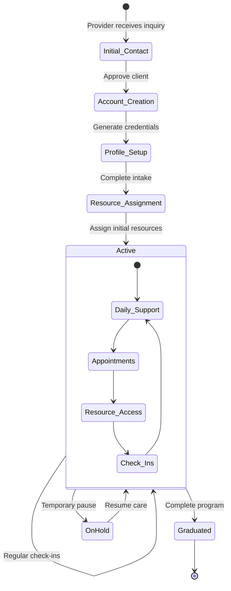
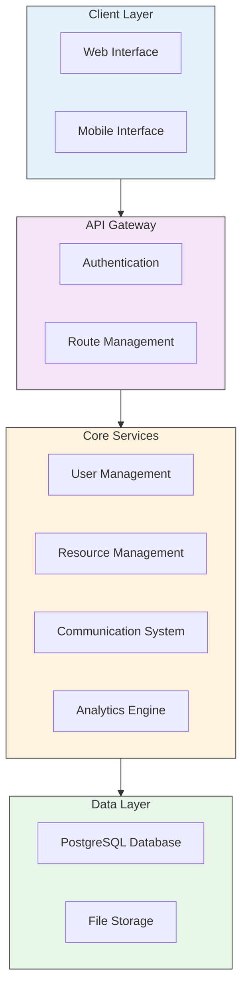
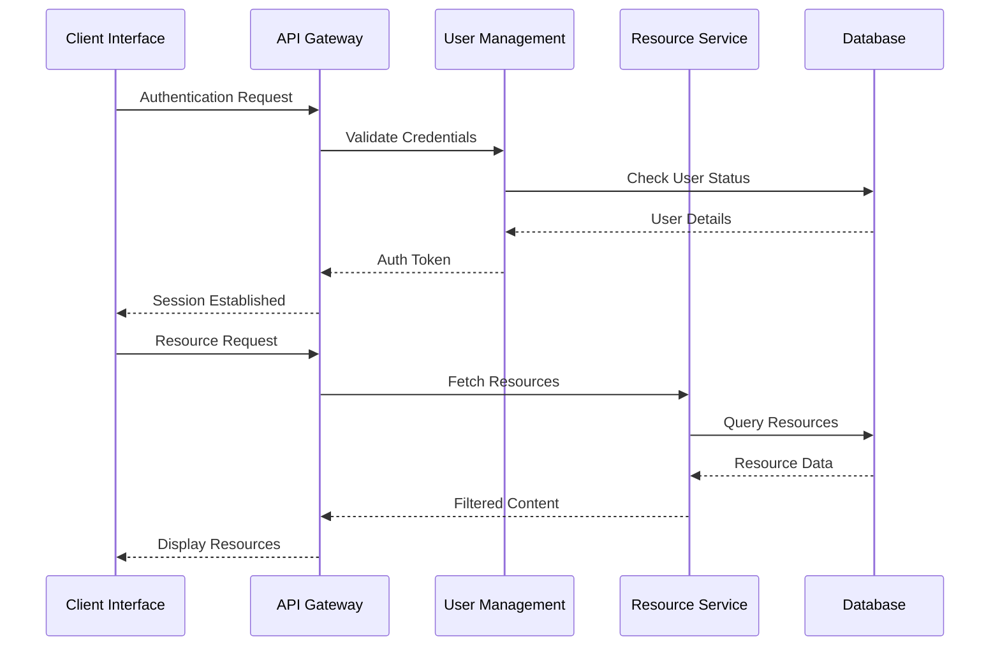
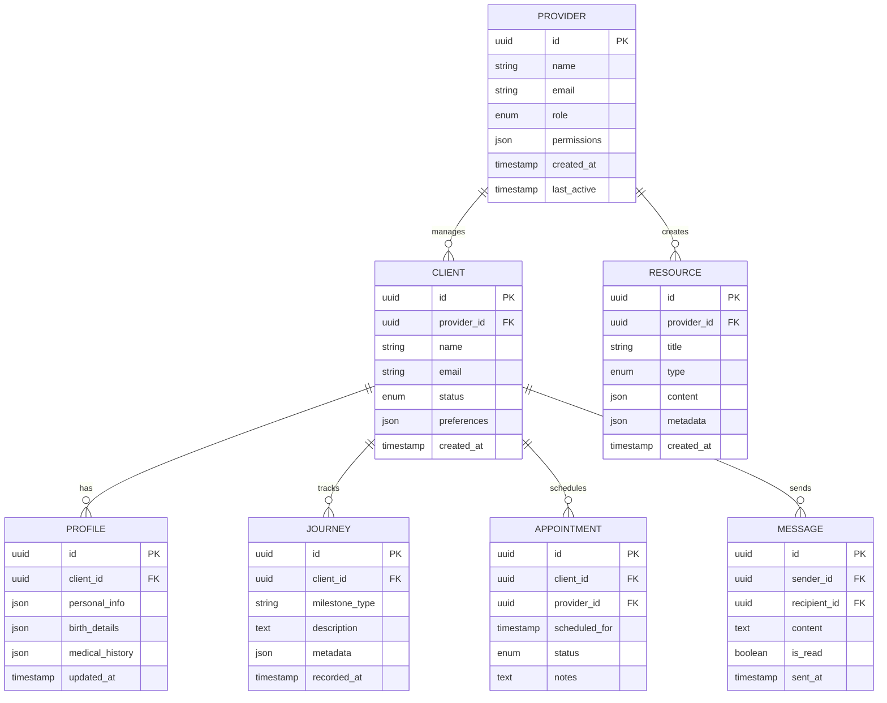
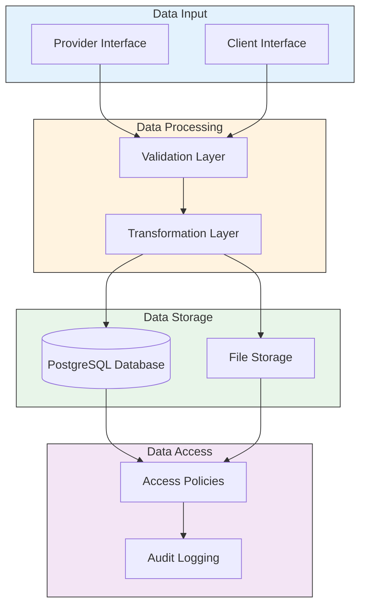

## Provider-Controlled System Design Document

*May 2025*

---

## Table of Contents

- [Provider-Controlled System Design Document](#provider-controlled-system-design-document)
- [Table of Contents](#table-of-contents)
- [Executive Summary](#executive-summary)
- [System Overview](#system-overview)
  - [Core Principles](#core-principles)
- [Provider Dashboard Features](#provider-dashboard-features)
  - [Client Management Center](#client-management-center)
  - [Journey Management](#journey-management)
  - [Communication Hub](#communication-hub)
  - [Analytics and Insights](#analytics-and-insights)
- [Security \& Access Control](#security--access-control)
  - [Authentication System](#authentication-system)
  - [Data Protection](#data-protection)
- [Technical Implementation](#technical-implementation)
  - [Core Services](#core-services)
  - [Data Architecture](#data-architecture)
  - [Integration Points](#integration-points)
- [User Management Workflow](#user-management-workflow)
  - [Client Lifecycle Flow](#client-lifecycle-flow)
  - [New Client Onboarding](#new-client-onboarding)
  - [Ongoing Management](#ongoing-management)
- [Technical Implementation](#technical-implementation-1)
  - [System Architecture](#system-architecture)
  - [Service Communication Flow](#service-communication-flow)
- [Data Architecture](#data-architecture-1)
  - [Entity Relationships](#entity-relationships)
  - [Data Flow](#data-flow)

---

## Executive Summary

Following discussions with Sarah, we are implementing a provider-controlled access system for LUNARA. This approach ensures that only verified clients can access the platform, enhancing security and allowing for a more personalized onboarding experience. This document outlines how providers will manage client accounts, handle onboarding, and maintain oversight of the client journey through a comprehensive administrative dashboard.

The provider-controlled system represents a significant shift from our initial self-service model, placing the power of account creation and management firmly in the hands of trusted providers. This change not only enhances security but also ensures that every client's digital journey begins with the same personal touch that characterizes Sarah's in-person care.

---

## System Overview

The provider-controlled system transforms LUNARA's access model from self-service to provider-managed, where all client accounts are created and configured by authorized providers. This fundamental shift strengthens the platform's security, ensures data quality, and maintains the intimate nature of the doula-client relationship from the very first digital interaction.

At its core, the system empowers providers to create and nurture digital relationships with their clients in a way that mirrors their personal care philosophy. By managing the entire client lifecycle - from initial account creation through ongoing support and eventually to post-care archival - providers maintain complete oversight of their digital practice.

### Core Principles

The provider-controlled system is built upon five foundational principles that guide every aspect of its design and implementation:

The system places providers at the center of the access management process through Provider-First Access Control. Only authorized providers can create new client accounts, ensuring that every user in the system has a direct, verified relationship with a provider. This approach eliminates unauthorized access and maintains the professional nature of the platform.

Our Structured Onboarding process follows a carefully designed pathway that providers use to gather client information systematically. This approach ensures consistency in data collection while allowing for the personalization necessary in postpartum care. The process adapts dynamically based on client needs while maintaining a standardized core of essential information.

Through Comprehensive Oversight, providers maintain complete visibility over their clients' journeys through the platform. This oversight includes real-time activity monitoring, engagement tracking, and progress assessment. The system aggregates this information into actionable insights that help providers deliver more effective, personalized care.

Privacy protection goes beyond basic security measures to create a trusted environment for sensitive information sharing. The system implements role-based access control, encryption at rest and in transit, and detailed audit logging. These measures ensure that client information remains confidential while remaining accessible to authorized care providers.

Quality Assurance is achieved by standardizing data collection and verification processes, helping maintain high-quality information across all client records. This standardization supports better care delivery while making it easier to identify trends and patterns across the practice.

---

## Provider Dashboard Features

The provider dashboard serves as the command center for managing all aspects of client care and practice administration. Each feature has been thoughtfully designed to support efficient workflow while maintaining the personal touch essential to postpartum care.

### Client Management Center

The Client Management Center forms the heart of the provider dashboard, offering comprehensive tools for managing client relationships throughout their care journey. Through this centralized interface, providers can oversee every aspect of their client relationships, from initial onboarding through ongoing care and support.

Account creation begins with a guided process that helps providers gather essential information about new clients. The system captures detailed personal information, including communication preferences and emergency contacts, creating a foundation for personalized care delivery. Providers record the client's birth experience, including delivery type and any complications, which helps inform initial care plans and resource recommendations.

Understanding each family's unique support needs is crucial. Providers document preferred support methods, communication styles, and specific areas where clients feel they need the most assistance. This information, combined with relevant medical history and current medications, allows providers to create highly personalized care approaches. The system maintains a complete history of profile changes, enabling providers to track how client needs and circumstances evolve throughout their care journey.

The client overview dashboard presents a unified view of all active clients in a format designed for quick assessment and action. Providers can instantly see each client's postpartum week, recent activity, and any pending actions or concerns. Visual indicators highlight engagement levels and appointment attendance, while a timeline displays recent interactions including messages, appointment notes, and resource access. The system automatically flags concerning patterns or missed check-ins, ensuring no client falls through the cracks.

### Journey Management

Journey management in LUNARA transforms traditional progress tracking into a comprehensive story of each client's postpartum experience. The system creates a living narrative of each family's journey, combining objective data with subjective observations and personal milestones.

Care plans evolve dynamically based on ongoing assessments and client feedback. Providers can adjust support strategies, resource recommendations, and intervention levels based on real-time insights into client needs and progress. The system tracks these adjustments, creating a clear picture of what works best for each family.

Resource engagement tracking provides deep insights into how clients interact with educational materials and support tools. Providers can see which resources resonate most strongly with their clients, when they're accessed, and how they impact overall progress. This information helps providers refine their resource recommendations and identify gaps in their support materials.

### Communication Hub

The Communication Hub reimagines how providers connect with their clients in the digital space. Moving beyond simple messaging, it creates a comprehensive communication ecosystem that maintains the warmth and personal touch of in-person care.

Secure messaging features allow for natural, ongoing dialogue between providers and clients. The system supports rich media sharing, enabling providers to send customized resources, voice messages, and even short video demonstrations. Message templates help providers maintain consistent communication while saving time on routine updates.

The appointment management system integrates seamlessly with providers' existing calendars while offering smart scheduling features. The system considers factors like postpartum week, previous appointment patterns, and provider availability to suggest optimal meeting times. Automated reminders adapt their timing and content based on each client's communication preferences and engagement patterns.

### Analytics and Insights

The analytics dashboard transforms raw data into actionable insights while maintaining the human-centered focus essential to postpartum care. Rather than overwhelming providers with numbers, it presents meaningful patterns and trends that inform care decisions.

Engagement metrics are presented in context, helping providers understand not just what clients are doing but why. The system identifies patterns in resource usage, communication preferences, and support needs across different stages of the postpartum journey. These insights help providers anticipate client needs and proactively adjust their support strategies.

Custom reporting tools allow providers to generate meaningful summaries of client progress and practice performance. Reports can be tailored to different audiences - from detailed clinical summaries to gentle progress updates for families. The system maintains a balance between comprehensive data collection and meaningful interpretation, ensuring that analytics serve to enhance rather than replace the provider's intuition and expertise.

---

## Security & Access Control

Security in LUNARA goes beyond traditional authentication measures, creating a comprehensive framework that protects sensitive information while maintaining the intimate, trusting relationship between providers and clients. Our security model recognizes that postpartum care requires both rigorous data protection and the flexibility to share information appropriately within the care relationship.

### Authentication System

Provider access to LUNARA implements multiple layers of security while remaining intuitive and efficient for daily use. The system uses the following security measures:

1. **Provider Registration Control**
   - Provider registration is controlled through a secure registration code system
   - The registration code (`LUNARA_PROVIDER_REGISTRATION_CODE`) is managed through environment variables
   - Default fallback values prevent accidental exposure of production credentials
   - Each environment (development, staging, production) uses different registration codes

2. **Environment Configuration**
   The system uses a layered configuration approach:
   ```yaml
   lunara:
     security:
       provider-registration-code: ${LUNARA_PROVIDER_REGISTRATION_CODE:default_invalid_code}
       jwt:
         secret-key: ${JWT_SECRET_KEY:default_invalid_key}
         expiration: 86400000 # 24 hours in milliseconds
   ```

3. **Development Setup**
   - Local development uses a secure environment setup script
   - Environment variables are managed through `setup-env.ps1`
   - Sensitive values are never committed to version control
   - Each developer maintains their own secure configuration

4. **Authentication Flow**
   For new provider registration:
   ```mermaid
   sequenceDiagram
       participant P as Provider
       participant A as Auth Service
       participant D as Database
       
       P->>A: Register Request + Code
       A->>A: Validate Registration Code
       A->>A: Validate Password Strength
       A->>D: Create Provider Account
       A->>P: Return JWT Token
   ```

5. **Password Security**
   - Strong password requirements enforced:
     - Minimum 8 characters
     - Must contain uppercase and lowercase letters
     - Must contain numbers
     - Must contain special characters
     - Passwords are hashed using BCrypt

6. **JWT Token Management**
   - Secure JWT tokens for session management
   - Configurable expiration times
   - Refresh token support for extended sessions
   - Token rotation for enhanced security

### Data Protection

Our encryption strategy creates multiple layers of protection around sensitive information. All communications between clients and providers travel through encrypted channels, protecting everything from routine messages to sensitive health information. The system encrypts data both in transit and at rest, using industry-standard algorithms that exceed typical healthcare security requirements.

The platform's backup system maintains continuous protection of all data while ensuring rapid recovery capabilities if needed. Encrypted backups occur automatically at regular intervals, with additional safeguards around particularly sensitive information. The backup strategy balances comprehensive protection with practical recovery times, ensuring that no client information is ever at risk of loss.

## Technical Implementation

The technical architecture of LUNARA reflects our commitment to creating a secure, scalable, and responsive platform that can grow alongside providers' practices. Rather than following a monolithic approach, we've designed a system of interconnected services that work together seamlessly while maintaining clear boundaries of responsibility.

### Core Services

The Authentication Service forms the gateway to LUNARA, managing not just basic access control but the entire identity and permission framework. It handles the complexities of multi-factor authentication, session management, and role-based access control. The service maintains detailed audit logs of all authentication events, providing both security oversight and compliance documentation.

Our User Management Service takes a holistic approach to handling user data and relationships. Rather than simply storing user information, it actively manages the entire lifecycle of both provider and client accounts. The service handles everything from initial account creation through profile updates, status changes, and eventually account archival. It maintains the relationships between providers and clients, ensuring that access controls and information sharing align with these relationships.

The Resource Service manages LUNARA's extensive library of support materials and educational content. It handles not just storage and retrieval but also version control, access tracking, and dynamic content adaptation. The service can customize resource presentations based on client preferences and needs, while maintaining strict control over who can access and modify materials.

The Communication Service creates the backbone of provider-client interaction, managing not just message delivery but the entire communication workflow. It handles message routing, notification management, and communication history while maintaining end-to-end encryption of all sensitive content. The service integrates with external notification systems while keeping all actual message content within LUNARA's secure environment.

Analytics capabilities are built into every aspect of LUNARA through our Analytics Service. Rather than treating analytics as an afterthought, we've designed the system to thoughtfully collect and analyze data from all user interactions. The service transforms this raw data into actionable insights while maintaining strict privacy controls. It can identify patterns and trends without exposing sensitive individual information, helping providers improve their practice while protecting client privacy.

### Data Architecture

Our data architecture creates a flexible but structured foundation for storing and managing all platform information. The relationship between providers and clients forms the core of this structure, with all other data elements connecting to this central relationship. This approach ensures that access controls and information sharing naturally follow the provider-client relationship while maintaining clear boundaries between different providers' practices.

The Provider entity serves as the anchor point for practice-level information, storing not just basic provider details but also their role definitions, permissions, and practice preferences. This design allows for future expansion to support multiple providers working together while maintaining clear lines of responsibility and access control.

Client records maintain comprehensive information about each family's journey while keeping this information clearly organized and easily accessible. Rather than storing client information as a simple profile, the system maintains a rich history of their entire journey, from initial intake through ongoing care and eventual graduation from services.

The Profile schema adapts to different types of information while maintaining consistent structure and searchability. Using a flexible JSON structure for certain fields allows the system to accommodate varying information needs without requiring database schema changes. This flexibility proves particularly valuable for storing birth details and preferences, where information needs can vary significantly between clients.

Journey tracking maintains both structured milestone data and unstructured narrative information about each client's progress. This dual approach allows for both quantitative tracking of progress and qualitative documentation of the care experience. The system can generate progress reports and identify patterns while preserving the narrative quality of each family's unique journey.

### Integration Points

LUNARA's integration framework allows the platform to connect seamlessly with external systems while maintaining strict security boundaries. Each integration point follows a carefully designed protocol that ensures secure data exchange while preventing unauthorized access to sensitive information.

The Email Service integration handles all outbound communications, from welcome messages to appointment reminders. It maintains secure delivery channels while supporting rich formatting that maintains LUNARA's warm, supportive aesthetic. The service includes delivery tracking and bounce handling while keeping all sensitive content within LUNARA's secure environment.

Calendar integration supports sophisticated appointment management while respecting provider and client preferences. The system can sync with external calendar systems while maintaining privacy around appointment details. It handles timezone management and availability tracking while ensuring that sensitive information remains protected.

Document management integration provides secure storage and sharing of files while maintaining strict access controls. The system supports various document types, from intake forms to educational materials, while ensuring that all stored content remains encrypted and properly protected.

The analytics platform integration allows for sophisticated data analysis while maintaining strict privacy controls. It can identify trends and patterns across the practice while keeping individual client information properly protected. The system supports custom report generation and data visualization while ensuring that all exported data maintains appropriate privacy protections.

---

## User Management Workflow

### Client Lifecycle Flow



The client lifecycle in LUNARA follows a carefully designed pathway that begins with initial contact and continues through graduation from services. Each stage includes specific activities and checkpoints that ensure comprehensive care delivery while maintaining security and privacy.

### New Client Onboarding

1. **Initial Contact**
   - Provider receives client inquiry
   - Basic information collection
   - Service agreement completion
   - Account creation approval

2. **Account Creation**
   - Provider creates client profile
   - System generates temporary credentials
   - Welcome email with login instructions
   - Initial resource package assignment

3. **Profile Completion**
   - Provider completes comprehensive intake
   - Care plan configuration
   - Resource customization
   - Appointment scheduling

4. **Activation & Monitoring**
   - Account activation
   - Initial login verification
   - Engagement monitoring
   - Support adjustment as needed

### Ongoing Management

1. **Regular Review**
   - Activity monitoring
   - Progress assessment
   - Resource adjustment
   - Care plan updates

2. **Support Optimization**
   - Engagement analysis
   - Resource effectiveness review
   - Communication pattern assessment
   - Care plan refinement

## Technical Implementation

### System Architecture



### Service Communication Flow



## Data Architecture

### Entity Relationships



### Data Flow



---

*This document serves as the foundation for implementing LUNARA's provider-controlled system. It will be updated as we gather feedback and refine the implementation through our development sprints.* 