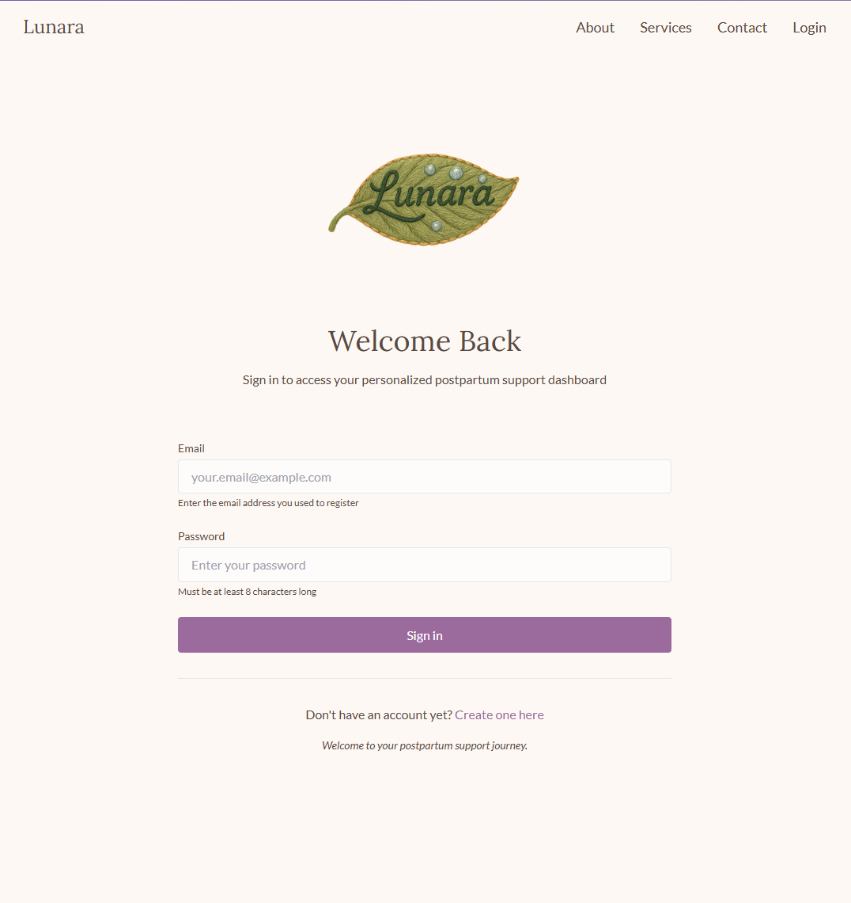
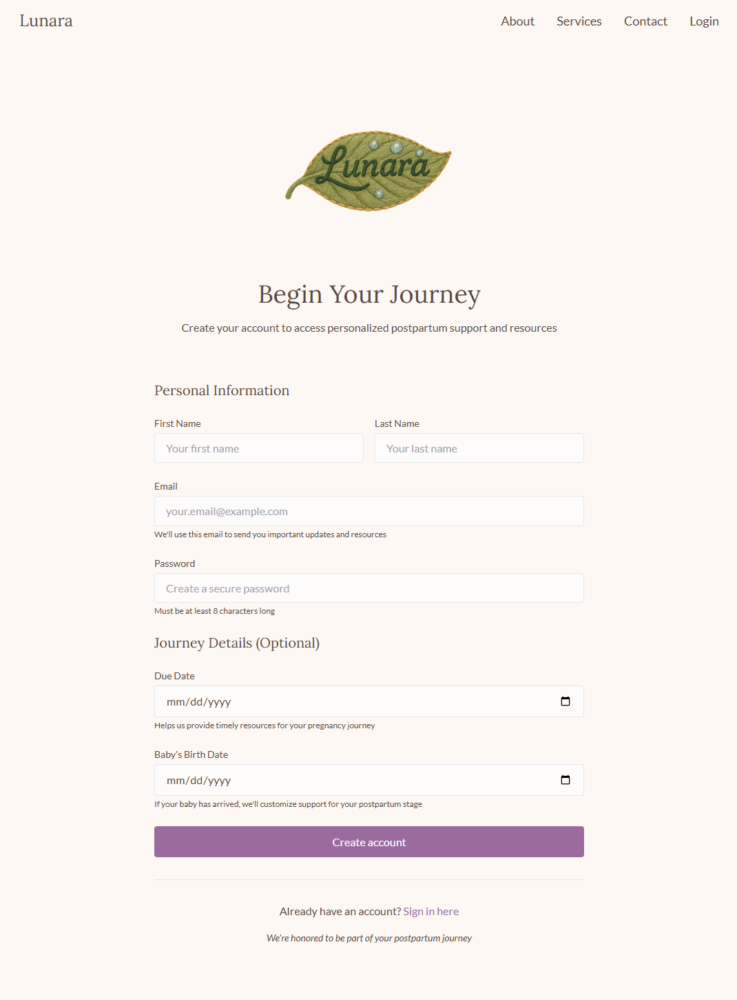
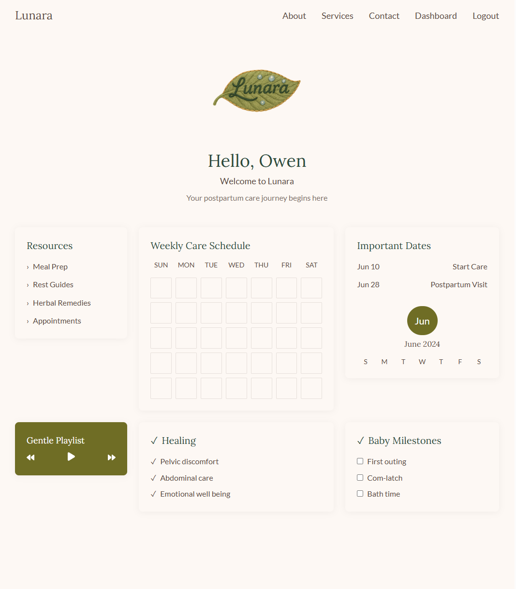
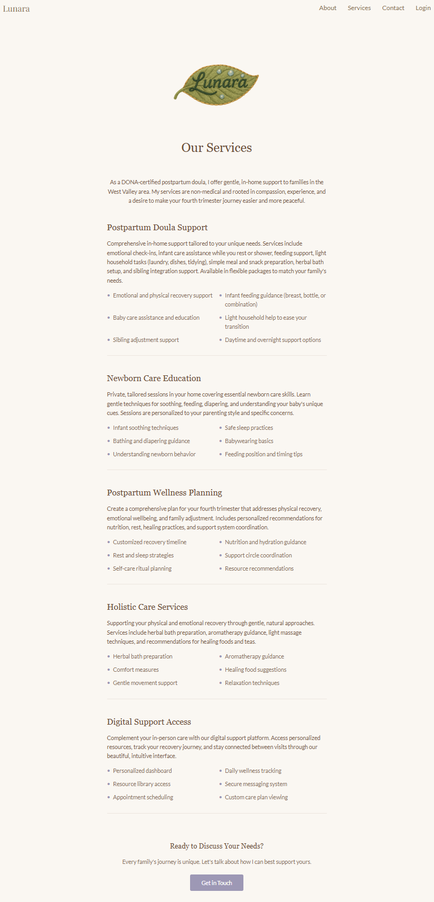
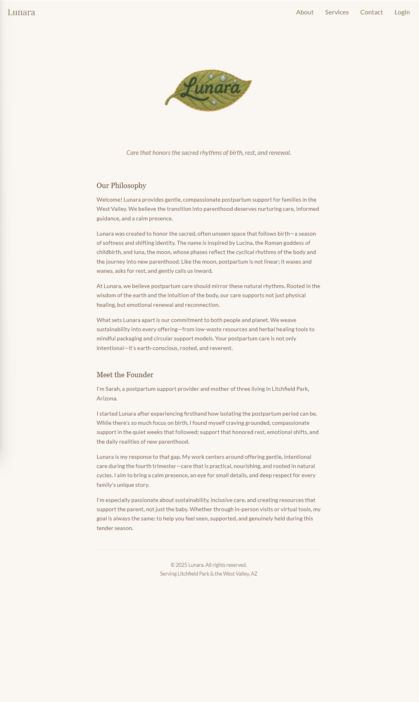
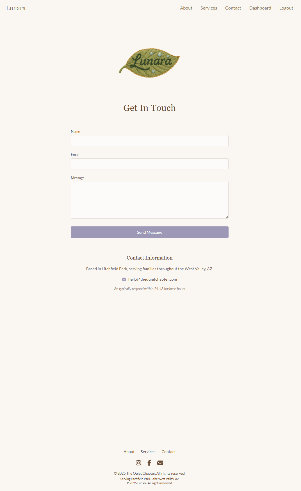

# LUNARA - Gentle Postpartum Support Platform

LUNARA transforms the postpartum support experience through a thoughtfully designed digital platform for both new parents and postpartum support specialists. By combining enchanting storybook-inspired aesthetics with intuitive, practical tools, we create a digital sanctuary that nurtures families through their fourth trimester journey.

## Mission

Our mission is to develop a platform that feels less like traditional software and more like a treasured companion—offering personalized guidance, emotional support, and practical resources when families need them most. The gentle interface provides families with on-demand access to their care companion's wisdom while giving postpartum specialists powerful tools to enhance their practice.

## Features

### For Families
- **Personalized Journey Guidance** tailored to unique birth experiences, feeding choices, and recovery needs
- **Intuitive Care Tools** including gentle mood and symptom tracking
- **Digital Journaling Space** with AI companion for prompts and affirmations
- **Direct Connection** to your care companion through secure messaging and scheduling
- **Resource Treasury** featuring articles, meditations, and practical guides

### For Support Specialists
- **Client Wellbeing Monitoring** through an intuitive dashboard
- **Streamlined Administrative Tasks** with automated reminders and templates
- **Personalized Resource Curation** for specific client needs
- **Practice Analytics** for continuous care improvement
- **Beautiful Communication Tools** maintaining brand aesthetics

## Screenshots

### Authentication & Onboarding

### Core Experience

### Information & Support

## Technical Stack

- **Frontend**: React with TypeScript, TailwindCSS
- **Backend**: Java Spring Boot
- **Database**: PostgreSQL
- **AI Features**: Python microservice with efficient models

## Team

- **Owen Lindsey**: Full Stack Developer & Project Manager
- **Carter Wright**: Full Stack Developer & Scrum Master
- **Andrew Mack**: Full Stack Developer & Development Lead

## Development Status

Currently in active development, with planned launch in December 2025. The platform is being developed as a senior capstone project at Grand Canyon University.

## Contact

For inquiries about LUNARA or to learn more about our postpartum support services, please visit our [Contact Page](https://lunara-care.com/contact).

---

*LUNARA - Nurturing the Sacred Journey of the Fourth Trimester*
